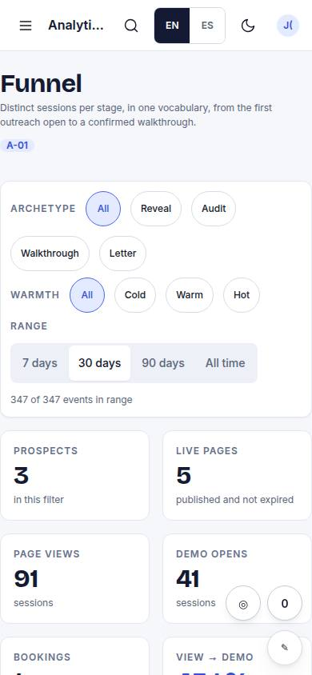
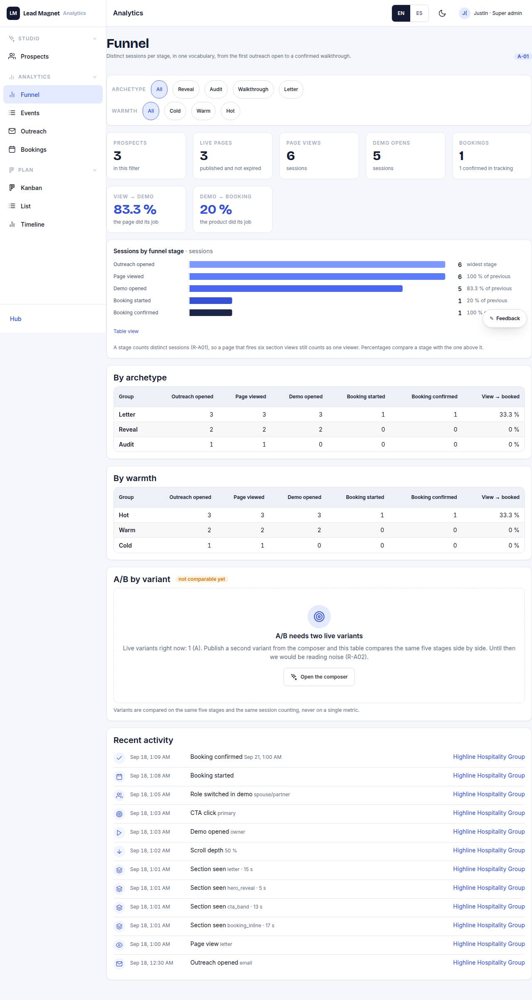

# A-01 · Funnel overview

## Purpose

The staff home for analytics: whether outreach is opened, whether the page converts to the demo, and whether the demo converts to a booked call - all in one vocabulary, over one date range, with breakdowns that cannot disagree with each other because they share the counting code. When a slug is running an A/B, the same five stages are read side by side for variant A and variant B, honestly: no winner until the sample is there.

## Screenshots

| 390 | 1280 |
| --- | --- |
|  |  |

Captured 2026-09-19 (T20) at 390 / 1280 - **before** the A/B readout; re-capture with the screenshot sweep (T31).

## Sections (layout order)

1. Filters - archetype chips, warmth chips, date range `SegmentedControl` (7 / 30 / 90 / all + "{shown} of {all} events in range")
2. KPI row - prospects, live pages, page views, demo opens, bookings, view→demo, demo→booking
3. Funnel chart - the five stages as an ordinal bar chart with a table view in a disclosure
4. By archetype / by warmth - the same five stages as `DataTable`s
5. **A/B readout** - slug `Select` (only slugs running a split) + deep link `/#/admin?slug=<slug>`; the two sides as cards (variant, archetype, status, live since, sessions, view→demo with its counts, open-the-variant link); one `PairedBarChart` with both funnels on a shared scale; the comparison `DataTable` (per stage: A sessions, A of-previous with counts, B sessions, B of-previous with counts, B − A in percentage points); the verdict line; the promote-B recommendation block when B is ahead
6. Recent activity - last 12 events with icon, time, summary and prospect link

## Data

| Table | Read / write | Notes |
| --- | --- | --- |
| `events` | read | the funnel itself |
| `pages` | read | join for archetype and variant |
| `prospects` | read | join for warmth; KPI scope |
| `bookings` | read | the bookings KPI (rows, not events) |
| `recommendations` | read / insert | the A/B readout records `kind: promote_variant`, `status: proposed` - and nothing else (R-A03) |

## Actions

| id | intent | permission |
| --- | --- | --- |
| `admin.filterFunnel` | "filter the funnel by {archetype}, {warmth} and the last {range} days" | `events.read` |
| `admin.compareVariants` | "compare the A/B variants on {slug}" | `events.read` |
| `admin.recordAbWinner` | "record the recommendation to promote the winning variant" | `prospects.write` |
| `admin.openProspect` | "open the timeline for {prospect}" | `prospects.read` |
| `admin.openStudio` | "open the studio" | `pages.publish` |

`admin.compareVariants` answers with the running splits when the slug it is given is not one of them, so the voice / WebMCP caller is never left guessing.

## Rules

- `R-A01` - `FUNNEL_STAGES` is the only stage vocabulary and every breakdown uses it in order
- `R-A02` - an A/B readout exists only for a slug with two live `pages` rows; rates always carry their session counts; variants are never pooled across slugs
- `R-A03` - a winning side becomes a recorded `recommendations` row, never a change to a live page
- `R-A04` - no side is called ahead below 30 view sessions per variant and a 10 % relative lift
- `R-C06` - the page only reads what `track()` wrote

## Logic

- A stage counts **distinct `session_id`**, so a page firing six `section_view`s is still one viewer. `src/modules/admin/funnel.ts` is pure and shared with A-02 and with the A/B readout.
- Archetype joins through `events.page_id`; warmth joins through `events.prospect_id`; the A/B side is the `pages` row the event points at, falling back to the `variant` the landing page stamped into `meta` (`variantOfEvent()`).
- The date range (7 / 30 / 90 / all, default 30) filters every number on the page, the A/B readout included.
- Conversion labels return an em dash rather than dividing by zero.
- **A/B (`src/modules/admin/ab.ts`, pure)**: a split is two live `pages` rows on one slug (D-061); each side's funnel is counted from `events` where `page_id` is that row, with the same `countSessions()`. The readout deliberately **ignores the archetype and warmth filters** - variant B is usually a different archetype, so filtering one side away would be the wrong comparison. The compared metric is **view → demo_open**, the page's own job; the sample gate is **30 view sessions per variant** and a **10 % relative lift** (`AB_MIN_SESSIONS`, `AB_MIN_LIFT`). Below the sample the card says exactly how far off each side is; between the sample and the lift it says "too close to call". Booking rates are shown but never decide - per page they are far too sparse.
- When B is ahead, **Record** inserts a `recommendations` row (`kind: promote_variant`, `status: proposed`, the reason carrying both rates with their counts, `score` = relative lift / 10) through the provider. Promoting B (expiring A) is a `Placeholder` by S-03 - the readout never changes a live page.
- Chart: ordinal single-hue ramp (`FunnelChart`), light mode `electric-400 → ink-700`, dark mode re-stepped `electric-700 → electric-200`; both validated for monotone lightness, step gaps and light-end contrast against their own surface. Labels, values and step percentages are text in text tokens, so nothing is colour-only.
- A/B chart: `PairedBarChart`, a **two-slot categorical** pair (identity, not rank) on **one shared scale** - two self-normalised funnels side by side would be the classic A/B misread. Light `#4A66F0` (`--electric-600`) vs `#6B9E22`, dark `#5B7CFF` (`--electric-500`) vs `#71A825`; both pairs run through the dataviz validator (lightness band, chroma floor, CVD separation, normal-vision floor, contrast) and pass in their own theme. Every bar also carries its series letter and its value as text, the legend names both sides with their archetypes, and the comparison table under it is always visible rather than hidden in a disclosure.

## Components

`Stat`, `FunnelChart`, `PairedBarChart` (new, molecule), `DataTable`, `SegmentedControl`, `Select`, `Field`, `Chip`, `Card`, `Badge`, `EmptyState`, `Placeholder`, `Button`, `Icon`.

The date range is a `SegmentedControl` for now; a shared `DateRange` molecule is being built by the foundation and A-01 / A-03 adopt it next pass. `DataTable` sortable headers are likewise left to the integrator.

## Real vs mock

Everything on this page is real: it reads the rows that landing pages, the demo and B-01 actually wrote. Seeded traffic comes from `src/data/seed/prospects.ts` and `src/data/seed/admin.ts` (two live A/B splits: Highline Hospitality past the sample with B ahead, Sonrisa Dental far below it; Maya's slug stays single-variant because it is the QA default for `/p/:slug`). Seeded sessions are `events` rows written exactly as `track()` writes them; they are not `bookings` rows, so the bookings KPI stays what prospects really booked. Nothing is estimated or extrapolated.

## Responsive check (P-01)

Declared at 360, 390, 768, 1280, 1920, 2560, 3840; checked in the browser at 360 / 390 / 768 / 1280 (light and dark) with no horizontal overflow at any of them. Under 720 px the funnel rows stack label / value / bar / percentage; under 900 px the recent list collapses to three rows per item. The two A/B side cards are a `grid-2` that becomes one column under 768 px (they still sit side by side at 768 itself), and `PairedBarChart` puts the stage label above its two bars under 720 px. `DataTable` carries its own card mode, which the six-column comparison table relies on below 768 px. Every control is keyboard-operable and 44 px: `SegmentedControl` is a radiogroup with arrow keys, the slug picker is a native `Select`, and the variant links are `Button`s inside anchors. 10-foot: KPI values use the display face at `--fs-2xl` and scale with `--scale` bands.

## Changelog

- `docs/changelog/0007-admin.md`
- `docs/changelog/0020-admin-ab-readout.md` (0.4.0 - T53 A/B readout, date range)
- `docs/changelog/0023-integration-pass-3.md` (pass 3 integration: `PairedBarChart` and the A / B swatches read `--lime-700` / `--lime-650`; `SEED_VERSION` 4 lands the seeded splits; SQL regenerated for `promote_variant`)
