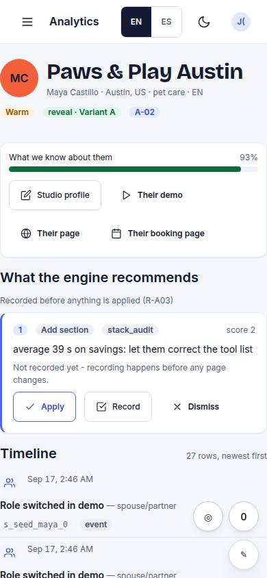
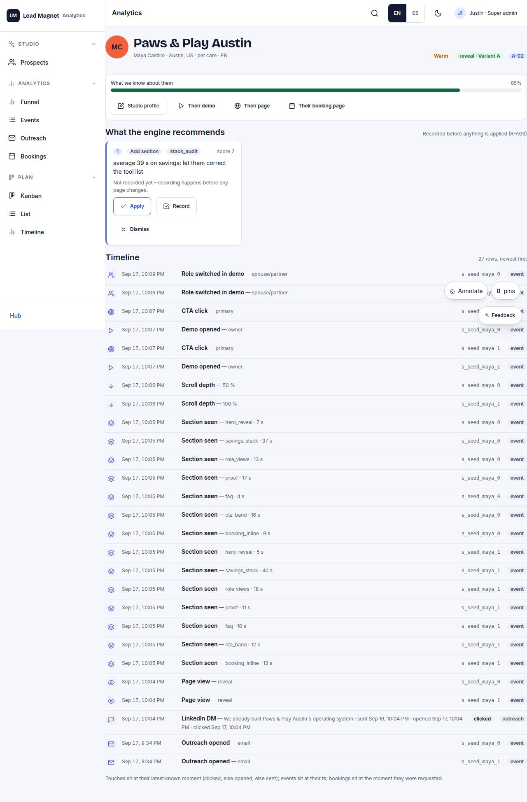

# A-02 · Prospect timeline

## Purpose

One prospect, everything they have done, in order - every outreach touch, every tracked event, every booking - plus what the engine now recommends changing about their page. Recommendations are recorded as rows before anything is applied, so a decision is never invisible (R-A03, P-08).

## Screenshots

| 390 | 1280 |
| --- | --- |
|  |  |

Not captured this pass - queued with the screenshot sweep (T31).

## Sections (layout order)

1. Header - avatar in their primary colour, business, person, city, industry, language, warmth, page archetype / variant
2. Confidence bar + shortcuts (studio profile, demo, page, booking page)
3. Recommendations - one `Card` each: kind, target, reason, score, recorded state, Apply / Record / Dismiss
4. Timeline - merged touches + events + bookings, newest first, with type icons, meta summaries, session ids and status badges

## Data

| Table | Read / write | Notes |
| --- | --- | --- |
| `prospects` | read | by route id |
| `pages` | read / write | applying an archetype switch writes `archetype` + `model` by id |
| `events` | read | timeline + `adaptFromEvents` |
| `touches` | read | timeline |
| `bookings` | read | timeline |
| `stack_guesses` | read | passed to `composePage` so savings stay correct |
| `recommendations` | write | **new table** - proposed / applied / dismissed with `decided_by`, `decided_at` |

## Actions

| id | intent | permission |
| --- | --- | --- |
| `admin.applyRecommendation` | "apply recommendation {n}" | `pages.publish` |
| `admin.recordRecommendation` | "record recommendation {n}" | `prospects.write` |
| `admin.dismissRecommendation` | "dismiss recommendation {n}" | `prospects.write` |
| `admin.openFor` | "open the {surface} for this prospect" | `prospects.read` |

## Rules

- `R-A03` - record first, then change; applying flips the row to `applied` with `decided_at`
- `R-A01` - the timeline uses the same event labels as the funnel
- `R-E02` - the ranking behind a `switch_archetype` recommendation is `pickArchetype`

## Logic

- `adaptFromEvents(page, events, prospect)` is re-derived on every render; nothing is cached, so a new event changes the advice immediately.
- Applying `switch_archetype` recomposes with `composePage(prospect, rec.to, { pageId, slug, guesses, expiresAt })` and writes `archetype` + `model` in one update.
- `add_section`, `shorten` and `ask` cannot be applied yet: their Apply is a `Placeholder` (by T12 / T11), while Record and Dismiss are real.
- A touch is placed at its latest known moment (clicked, else opened, else sent, else created).

## Components

`Card`, `Badge`, `Avatar`, `ProgressBar`, `Button`, `Placeholder`, `EmptyState`, `Icon`.

## Real vs mock

Real: the timeline, the engine recommendations, the recording, and the archetype switch (it really recomposes the live page model). Placeholder: applying the three non-archetype kinds.

## Responsive check (P-01)

Declared at 360, 390, 768, 1280, 1920, 2560, 3840; timeline rows collapse to a three-line stack under 900 px, recommendation cards are `grid-auto`.

## Changelog

- `docs/changelog/0007-admin.md`
