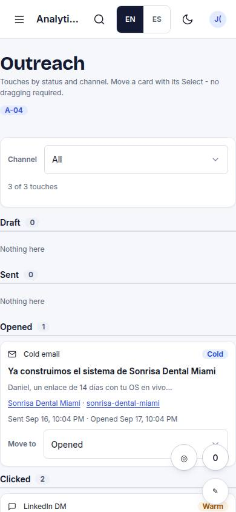
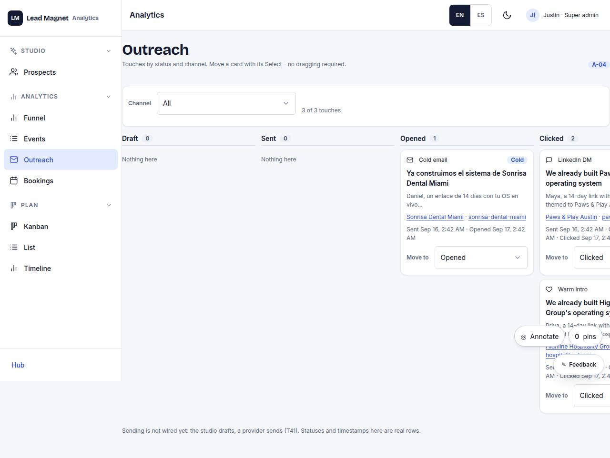

# A-04 · Outreach board

## Purpose

Touches by status (draft, sent, opened, clicked, replied) per channel.

## Screenshots

| 390 | 1280 |
| --- | --- |
|  |  |

Dark: `../screenshots/A-04/390-dark.jpg`, `../screenshots/A-04/1280-dark.jpg` (key pages).

## Sections (layout order)

1. status columns
2. cards

## Data

| Table | Read / write | Notes |
| --- | --- | --- |
| `touches` | read | |
| `prospects` | read | |

## Actions

| id | intent | permission |
| --- | --- | --- |
| `admin.moveTouch` | "mark {touch} as {status}" | `prospects.write` |

## Rules

- none yet

## Logic

- (to be specified)

## Components

Card, Badge

## Real vs mock

Stub (PageStub). Built by module admin (T15)

## Responsive check (P-01)

Not checked yet.

## Changelog

- `docs/changelog/0001-foundation.md`
