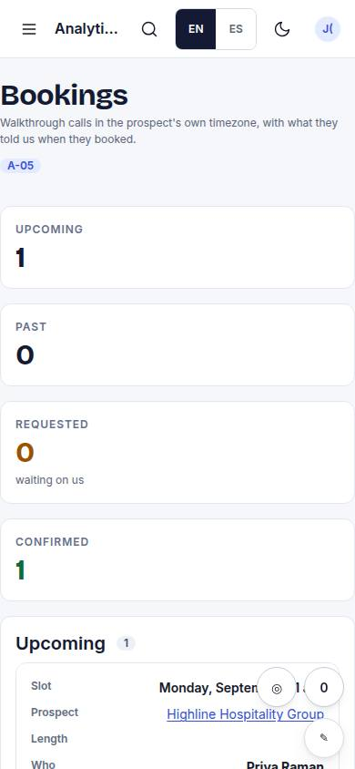
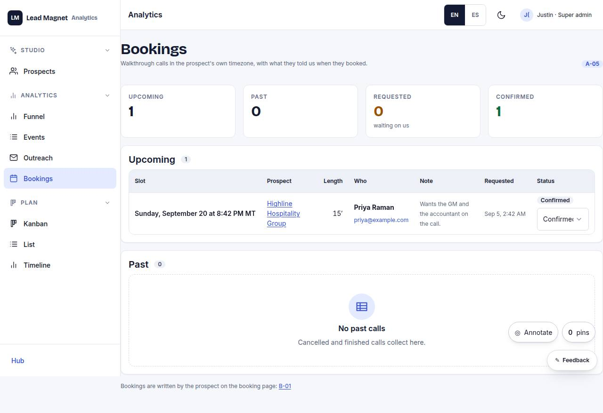

# A-05 · Bookings

## Purpose

Upcoming and past walkthrough calls: when, in the prospect's own timezone, who asked, what they wrote in the booking form, and a status you can change.

## Screenshots

| 390 | 1280 |
| --- | --- |
|  |  |

Not captured this pass - queued with the screenshot sweep (T31).

## Sections (layout order)

1. Counts - upcoming, past, requested (waiting on us), confirmed
2. Upcoming `DataTable`
3. Past `DataTable`

## Data

| Table | Read / write | Notes |
| --- | --- | --- |
| `bookings` | read / write | `status` written by id |
| `prospects` | read | name and the timezone the slot is rendered in |

## Actions

| id | intent | permission |
| --- | --- | --- |
| `admin.setBookingStatus` | "mark booking {id} {status}" | `prospects.write` |

## Rules

- `R-B02` - the length column is the row's `duration_min`, 15 by default
- `R-B03` - status writes go through the provider by id
- `R-P01` - the Select is gated with `can('prospects.write')`

## Logic

- Upcoming = `slot` in the future and not cancelled; everything else (past slot or cancelled) is past, newest first.
- The slot is rendered with `slotInWords()` from `src/engine/slots.ts`, in the prospect's guessed timezone and the current language - the same string the prospect saw on B-02.
- "Who" shows `contact_name`, `contact_email` (mailto) and `contact_phone` (tel) from the row; "Note" is the prospect's free text. Seeded rows and rows created before 0.2.0 reseed (`SEED_VERSION` 2).

## Components

`DataTable`, `Select`, `Stat`, `Badge`, `Card`.

## Real vs mock

Real rows and real writes. Not wired: the provider that would also move the event in an external calendar (T42).

## Responsive check (P-01)

Declared at 360, 390, 768, 1280, 1920, 2560, 3840; `DataTable` card mode on phones, slot strings kept on one line, status badge plus Select wrap together.

## Changelog

- `docs/changelog/0007-admin.md`
