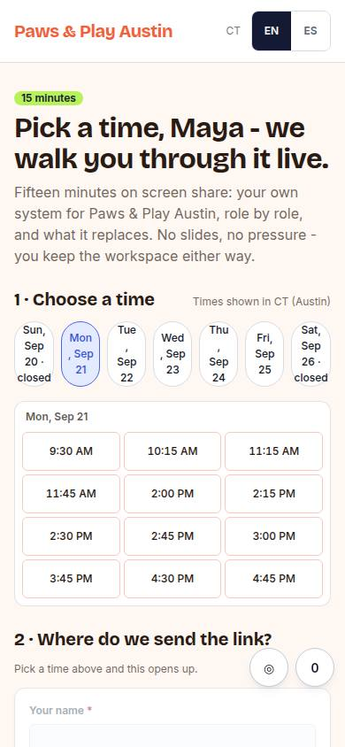
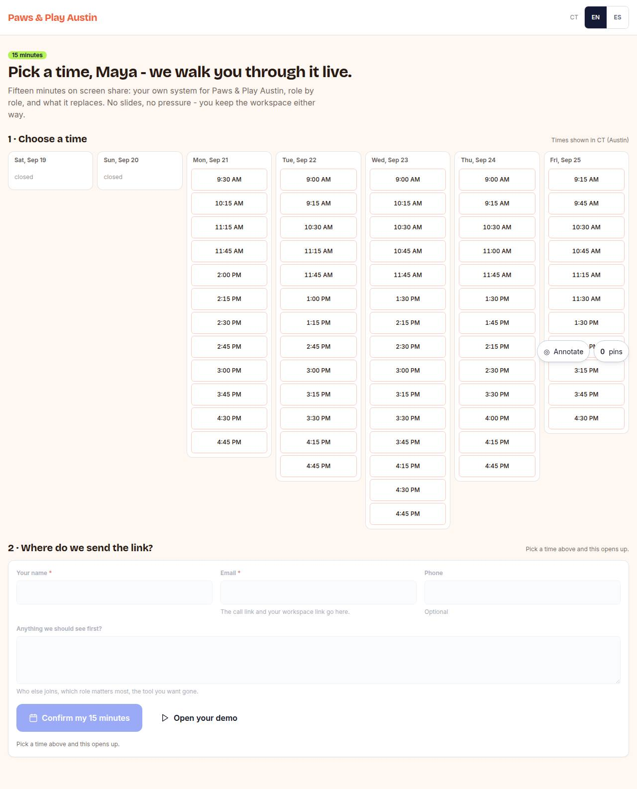

# B-01 · Book a call

## Purpose

Inline 15-min slot picker (mock calendar), name/email at the moment of value, writes bookings + booking_started/confirmed events.

## Screenshots

| 390 | 1280 |
| --- | --- |
|  |  |

Dark: `../screenshots/B-01/390-dark.jpg`, `../screenshots/B-01/1280-dark.jpg` (key pages).

## Sections (layout order)

1. slot grid (next 7 days)
2. details form
3. confirm

## Data

| Table | Read / write | Notes |
| --- | --- | --- |
| `bookings` | read | |
| `prospects` | read | |
| `events` | read | |

## Actions

| id | intent | permission |
| --- | --- | --- |
| `booking.pickSlot` | "book {slot}" | `booking.create` |
| `booking.confirm` | "confirm my booking" | `booking.create` |

## Rules

- none yet

## Logic

- (to be specified)

## Components

Card, Field, Input, Button

## Real vs mock

Stub (PageStub). Built by module booking (T14)

## Responsive check (P-01)

Not checked yet.

## Changelog

- `docs/changelog/0001-foundation.md`
