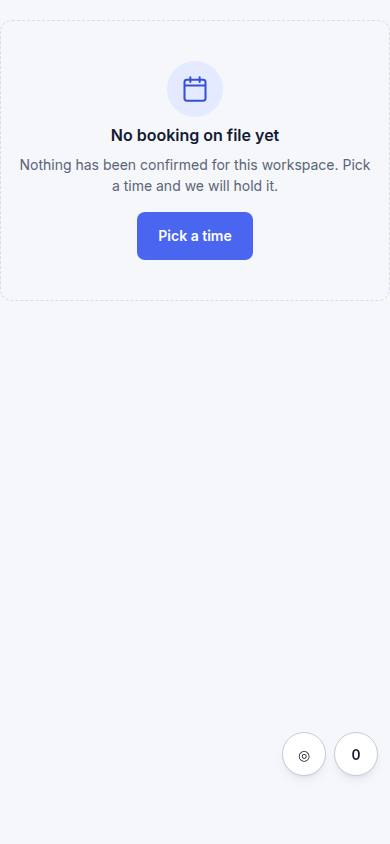
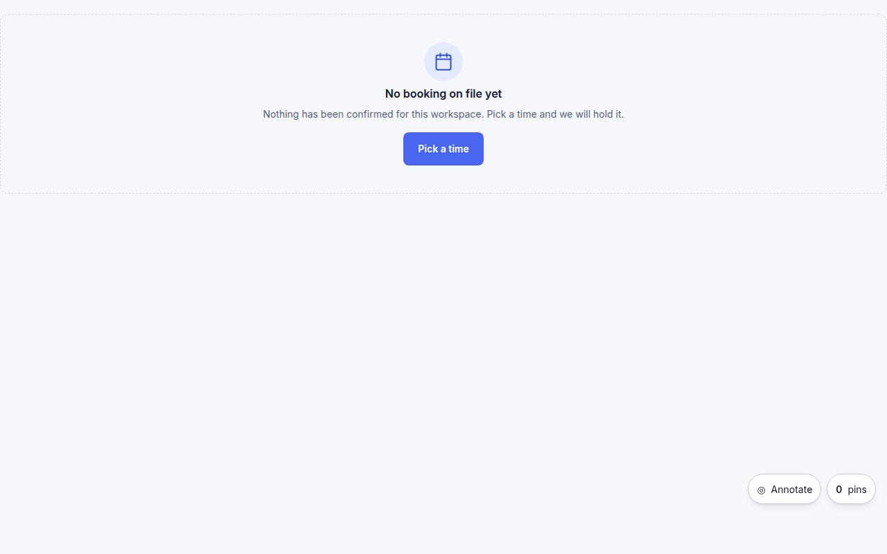

# B-02 · Booking confirmed

## Purpose

Confirmation with calendar add (Placeholder until a real provider) and a link back to their demo.

## Screenshots

| 390 | 1280 |
| --- | --- |
|  |  |

Dark: `../screenshots/B-02/390-dark.jpg`, `../screenshots/B-02/1280-dark.jpg` (key pages).

## Sections (layout order)

1. confirmation
2. add to calendar (Placeholder)
3. back to demo

## Data

| Table | Read / write | Notes |
| --- | --- | --- |
| `bookings` | read | |

## Actions

| id | intent | permission |
| --- | --- | --- |
| `booking.addToCalendar` | "add the call to my calendar" | any |

## Rules

- none yet

## Logic

- (to be specified)

## Components

Card, Placeholder

## Real vs mock

Stub (PageStub). Built by module booking (T14)

## Responsive check (P-01)

Not checked yet.

## Changelog

- `docs/changelog/0001-foundation.md`
