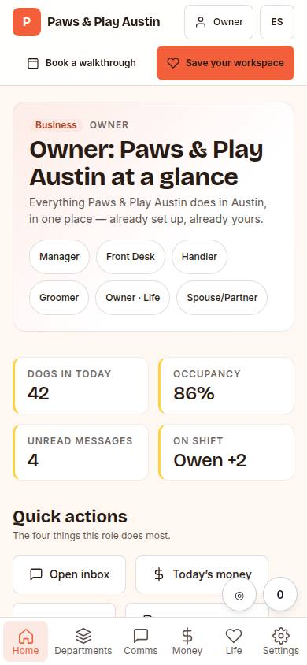
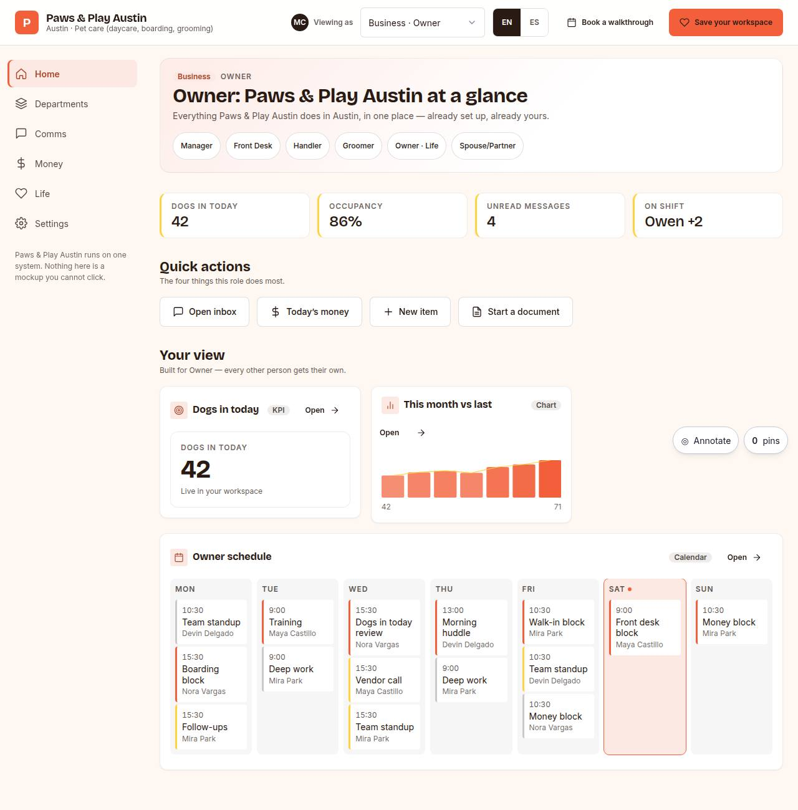

# C-01 · OS demo shell

## Purpose

The prospect's operating system, already built and themed to them. C-01 is the shell plus the default role home (the first business role): its own chrome (no DesktopShell) with a sidebar on desktop, a bottom nav on phone and a 10-foot layout at 1920 and above, a wordmark that is their business name, a role switcher listing every business and life role from `deriveRoleViews`, EN/ES, and a persistent but unobtrusive "Save your workspace" + "Book a walkthrough" pair. Nothing is gated (R-D03).

## Screenshots

| 390 | 1280 |
| --- | --- |
|  |  |

Dark: `../screenshots/C-01/390-dark.jpg`, `../screenshots/C-01/1280-dark.jpg` (key pages). Captured 2026-09-19 (T20) at 390 / 1280, light + dark.

## Sections (layout order)

1. top bar - wordmark (business name, city, industry), role switcher (business + life roles), EN/ES, save + book
2. sidebar (>= 900px) / bottom nav (< 900px) - Home, Departments, Comms, Money, Life, Settings
3. headline - the role view's bilingual headline plus chips for the other people in the business
4. today strip - four live-looking numbers from the industry KPIs
5. quick actions - two navigate, two are honest Placeholders
6. widgets grid - the role's widgets rendered by kind
7. save modal - name + email, only at the moment of value; writes a `form_submit` event

## Data

| Table | Read / write | Notes |
| --- | --- | --- |
| `prospects` | read | `useRow('prospects', id)`; unknown id renders an EmptyState with a link to the hub |
| `pages` | read | `useTable('pages', { where: { prospect_id } })` gives the `page_id` every event carries |
| `events` | write | `demo_open`, `demo_role_switch`, `section_view`, `cta_click`, `form_submit` |

## Actions

| id | intent | permission |
| --- | --- | --- |
| `demo.switchRole` | "view as {role}" | `demo.open` |
| `demo.goto` | "open {section}" | `demo.open` |
| `demo.saveWorkspace` | "save my workspace" | — |
| `demo.bookCall` | "book a walkthrough call" | `booking.create` |
| `demo.openWidget` | "open {widget}" | `demo.open` |
| `demo.quickAction` | "run the quick action {action}" | — |

## Rules

- `R-D01` - the demo root carries `prospectStyle()` and maps `--lp-*` onto the tokens the library components read
- `R-D02` - every business and life role appears in the role switcher
- `R-D03` - no form before value; the modal only opens when the visitor asks to save
- `R-C01` / `R-C06` - never gated, everything tracked

## Logic

- Role slugs are unique per view (`viewSlug`): a business role keeps the bare slug (`owner`), a life role that collides gets `life-` in front (`life-owner`), so every one of the prospect's views is reachable and the role `Select` has one option per view. The page opens in `prospects.lang` unless the viewer chose EN / ES (D-034).

- The active role lives in the URL; on `/demo/:prospectId` it falls back to the first business role.
- `demo_open` and `section_view` are deduped per session with `trackOnce`; `demo_role_switch` fires once per actual change, even when the change also changes route.
- Widget "Open" navigates where a real destination exists (chat -> comms, table -> money) and is a Placeholder otherwise.

## Components

`Card`, `Stat`, `Badge`, `Button`, `Chip`, `Avatar`, `Select`, `Field`, `Input`, `Modal`, `LangToggle`, `EmptyState`, `Placeholder`, `DataTable`, `Icon`.

## Real vs mock

Real: the prospect, their palette, their roles, the engine's role views, the tracking. Mocked: the sample calendar, messages and payments (deterministic, seeded from the prospect id). Not wired: the comms provider (T42), Stripe (T51), Supabase auth (T44) - each is a `Placeholder`, never a fake success.

## Responsive check (P-01)

Checked at: 360, 390, 768, 1280, 1920, 2560, 3840. Sidebar below 900 px becomes a six-item bottom nav (labels ellipsise at 360); the widgets, board and inbox grids collapse to one column; `DataTable` stacks into cards under 768; at 1920 and above `--scale` grows type and spacing and the demo widens the sidebar, the frame and the widget columns for 10-foot reading.

## Changelog

- `docs/changelog/0005-os-demo.md`

## Pass 2 (changelog 0016)

Under 600 px the top bar is two rows: wordmark, a "Viewing as <role>" button that opens the role list in a `Drawer` sheet, a compact EN/ES button, then Book + Save as two 44 px buttons (109 px of chrome, was 291 at 390). The role `Select`, the EN | ES group and the inline CTAs stay from 600 px up. Colours on the prospect's primary use the computed `--lp-on-primary` (D-087). The `public/frames/<prospectId>/` sequences the landing pages scrub were regenerated from this chrome.
