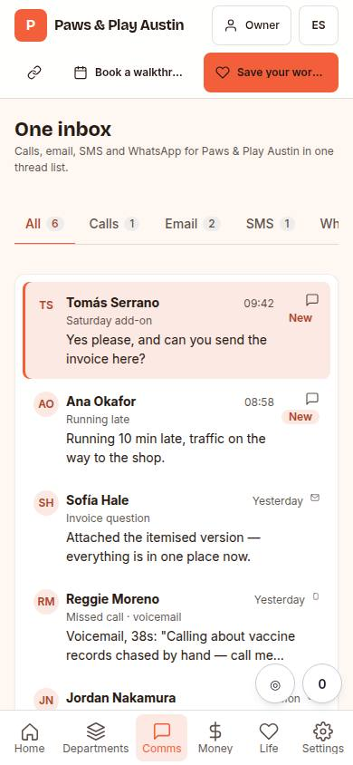
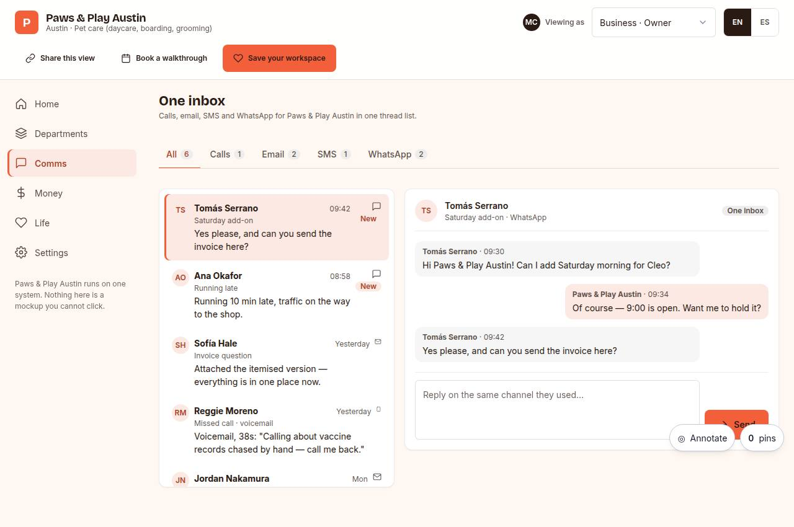

# C-04 · Comms inbox

## Purpose

One inbox for calls, email, SMS and WhatsApp, with sample threads that mention the business by name in both languages. The point of the page is that there is no second app: the composer is an honest Placeholder until the comms provider lands.

## Screenshots

| 390 | 1280 |
| --- | --- |
|  |  |

Dark: `../screenshots/C-04/390-dark.jpg`, `../screenshots/C-04/1280-dark.jpg` (key pages). Not captured yet - T31.

## Sections (layout order)

1. channel tabs (all, calls, email, SMS, WhatsApp) with counts
2. thread list
3. thread pane with the conversation
4. composer (Placeholder)

## Data

| Table | Read / write | Notes |
| --- | --- | --- |
| `prospects` | read | business name and roles appear in the sample threads |
| `pages` | read | page_id for tracking |
| `events` | write | `section_view` per channel filter |

## Actions

| id | intent | permission |
| --- | --- | --- |
| `demo.switchRole` | "view as {role}" | `demo.open` |
| `demo.goto` | "open {section}" | `demo.open` |
| `demo.saveWorkspace` | "save my workspace" | — |
| `demo.bookCall` | "book a walkthrough call" | `booking.create` |
| `demo.filterChannel` | "show {channel} only" | — |
| `demo.openThread` | "open the thread with {thread}" | — |
| `demo.reply` | "reply to {thread}" | — |

## Rules

- `R-D01`

## Logic

- Tabs are a real `Tabs` component with arrow-key movement; the panel is labelled by its tab.
- Thread selection is keyboard-complete: every thread row is a button, the active row is marked with `aria-current`, never colour alone.

## Components

`Tabs`, `Card`, `Avatar`, `Badge`, `Textarea`, `Placeholder`, `EmptyState`, `Icon`.

## Real vs mock

Real: the filtering, selection and layout. Mocked: the threads. Not wired: sending (T42 comms provider).

## Responsive check (P-01)

Checked at: 360, 390, 768, 1280, 1920, 2560, 3840. Sidebar below 900 px becomes a six-item bottom nav (labels ellipsise at 360); the widgets, board and inbox grids collapse to one column; `DataTable` stacks into cards under 768; at 1920 and above `--scale` grows type and spacing and the demo widens the sidebar, the frame and the widget columns for 10-foot reading.

## Changelog

- `docs/changelog/0005-os-demo.md`
