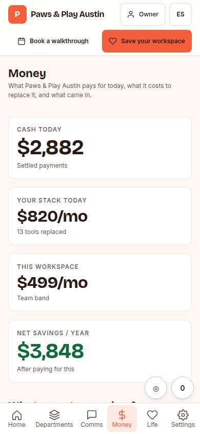
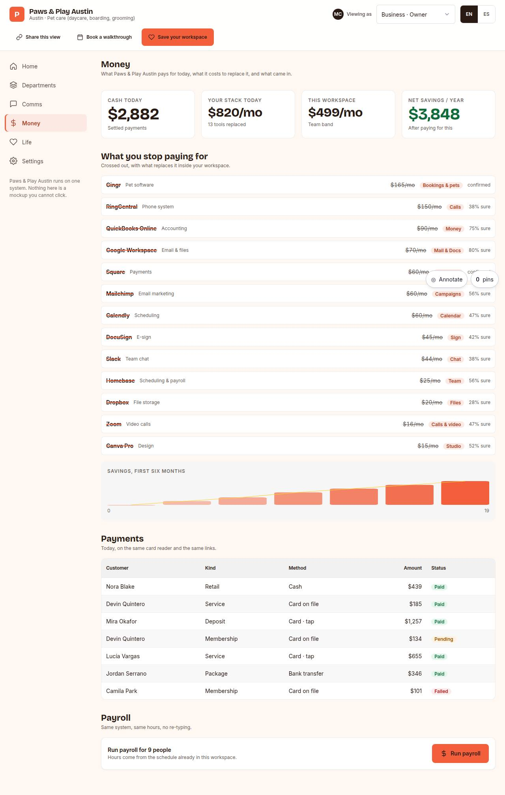

# C-05 · Money

## Purpose

The money page of their own OS: what they pay for today crossed out with what replaces it, the net savings, the cash that came in today, the payments list and payroll.

## Screenshots

| 390 | 1280 |
| --- | --- |
|  |  |

Dark: `../screenshots/C-05/390-dark.jpg`, `../screenshots/C-05/1280-dark.jpg` (key pages). Not captured yet - T31.

## Sections (layout order)

1. savings stats (cash today, stack today, this workspace, net per year)
2. crossed-out stack from `stack_guesses` with the replacing module and the confidence
3. savings curve (inline SVG)
4. payments `DataTable`
5. payroll (Placeholder, Stripe)

## Data

| Table | Read / write | Notes |
| --- | --- | --- |
| `stack_guesses` | read | live rows for this prospect, run through `savings()` |
| `prospects` | read | team size, price band |
| `pages` | read | page_id for tracking |
| `events` | write | `section_view` |

## Actions

| id | intent | permission |
| --- | --- | --- |
| `demo.switchRole` | "view as {role}" | `demo.open` |
| `demo.goto` | "open {section}" | `demo.open` |
| `demo.saveWorkspace` | "save my workspace" | — |
| `demo.bookCall` | "book a walkthrough call" | `booking.create` |
| `demo.shareView` | "copy the link to this view" | `demo.open` |
| `demo.openPayment` | "open payment {payment}" | — |

## Rules

- `R-D01`, `R-C03` - the savings are a concrete number, taken from the same engine the landing page uses

## Logic

- `savings(prospect, guesses)` drops rejected guesses, so correcting the stack in the studio or on the audit landing changes this page immediately.
- Cash today is the sum of the settled sample payments.

## Components

`Stat`, `Card`, `Badge`, `DataTable`, `Placeholder`.

## Real vs mock

Real: the stack, the savings maths, the price band. Mocked: the payments. Not wired: payments and payroll (T51 Stripe).

## Responsive check (P-01)

Checked at: 360, 390, 768, 1280, 1920, 2560, 3840. Sidebar below 900 px becomes a six-item bottom nav (labels ellipsise at 360); the widgets, board and inbox grids collapse to one column; `DataTable` stacks into cards under 768; at 1920 and above `--scale` grows type and spacing and the demo widens the sidebar, the frame and the widget columns for 10-foot reading.

## Changelog

- `docs/changelog/0005-os-demo.md`

## Pass 3 (changelog `0021-os-demo-pass-3.md`)

- **Share this view.** A 44 px "Share this view" button sits in the demo top bar on every C- page: it copies the deep link of what is on screen (`/#/demo/:id/role/:slug` on home, `/#/demo/:id/<section>` elsewhere - route paths and role slugs unchanged, D-037), tracks `cta_click { cta: 'share_view', role, section }`, and when the browser refuses the clipboard it shows the link in a selected, read-only field under the top bar instead of failing silently. Action `demo.shareView`.
- **10-foot.** Every fixed length in `demo.css` is now `calc(px * var(--scale))` (nav and thread rows, widget icon, calendar day, brand chip, accent bars, inbox column), the sidebar grows with the band (540 px at 3840, was 360), the demo lifts its two smallest type steps to 14 / 16 px base at >= 1920, and the `Icon` / chart pixel props follow the band through `useDemoScale()`.
- **Honest placeholders.** Every control that does nothing names what it will do and who builds it; the ones that pointed at finished task T13 now say "os-demo, a later pass", and the comms composer says "comms provider (no task yet)" because T42 is the booking provider.
