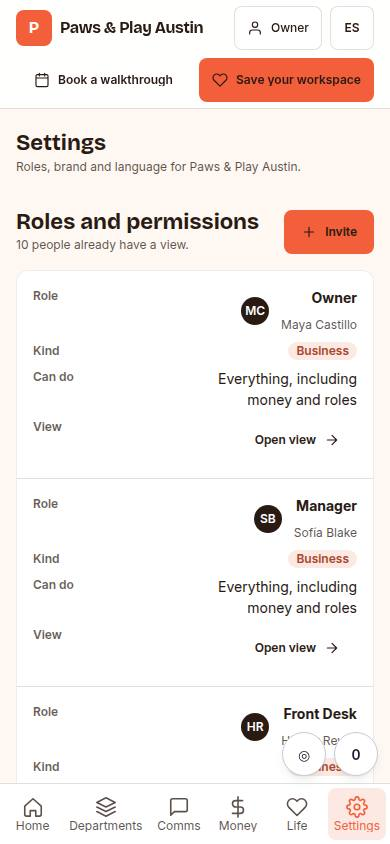
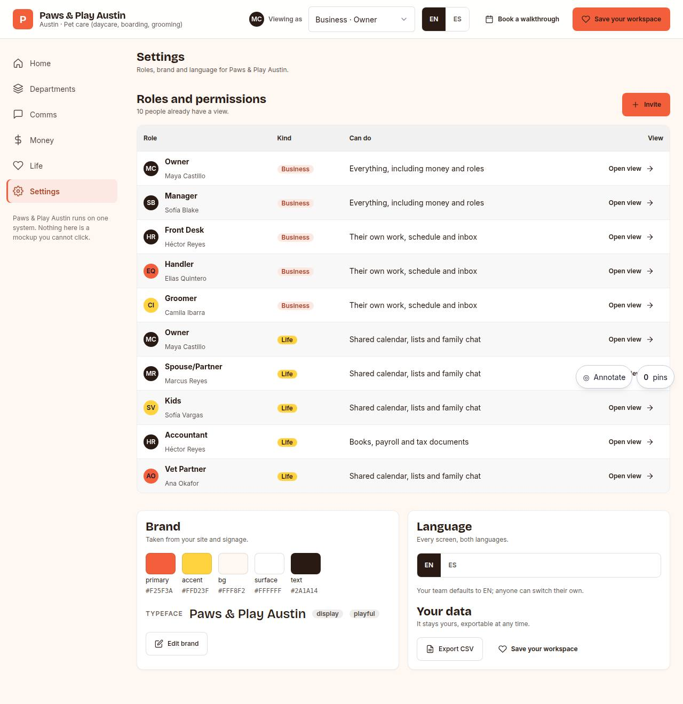

# C-07 · Settings & roles

## Purpose

Proof that the workspace is theirs and configurable: every business and life role with the person who holds it and a permission summary, the brand palette and typeface taken from their site, the language toggle, data export and invite.

## Screenshots

| 390 | 1280 |
| --- | --- |
|  |  |

Dark: `../screenshots/C-07/390-dark.jpg`, `../screenshots/C-07/1280-dark.jpg` (key pages). Not captured yet - T31.

## Sections (layout order)

1. roles table (business + life) with permission summary
2. brand palette swatches, typeface and tone
3. language
4. data export (Placeholder)
5. invite (Placeholder)

## Data

| Table | Read / write | Notes |
| --- | --- | --- |
| `prospects` | read | roles, palette, font, tone, default language |
| `pages` | read | page_id for tracking |
| `events` | write | `section_view`, `cta_click` |

## Actions

| id | intent | permission |
| --- | --- | --- |
| `demo.switchRole` | "view as {role}" | `demo.open` |
| `demo.goto` | "open {section}" | `demo.open` |
| `demo.saveWorkspace` | "save my workspace" | — |
| `demo.bookCall` | "book a walkthrough call" | `booking.create` |
| `demo.invite` | "invite {person}" | — |
| `demo.openRole` | "open {role}'s view" | `demo.open` |

## Rules

- `R-D01`, `R-D02`

## Logic

- The permission summary is derived from the role name (owner / staff / life / books) until real auth lands (T44); the demo never claims a permission model it does not have.
- Swatches print the hex so a prospect can check it against their brand guide.

## Components

`DataTable`, `Card`, `Badge`, `Avatar`, `Button`, `LangToggle`, `Placeholder`.

## Real vs mock

Real: the palette, font, roles and language. Mocked: the permission summary wording. Not wired: invites (T44 Supabase auth), CSV export, brand editing (T40).

## Responsive check (P-01)

Checked at: 360, 390, 768, 1280, 1920, 2560, 3840. Sidebar below 900 px becomes a six-item bottom nav (labels ellipsise at 360); the widgets, board and inbox grids collapse to one column; `DataTable` stacks into cards under 768; at 1920 and above `--scale` grows type and spacing and the demo widens the sidebar, the frame and the widget columns for 10-foot reading.

## Changelog

- `docs/changelog/0005-os-demo.md`
