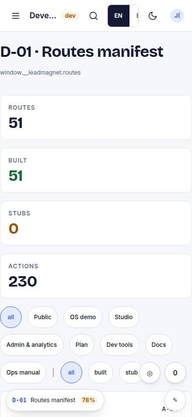
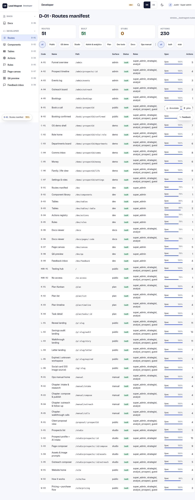

# D-01 · Routes manifest

## Purpose

Every route with code, surface, status, roles, spec completeness and action count; the same manifest window.__leadmagnet exposes.

## Screenshots

| 390 | 1280 |
| --- | --- |
|  |  |

Dark: `../screenshots/D-01/390-dark.jpg`, `../screenshots/D-01/1280-dark.jpg` (key pages).

## Sections (layout order)

1. counts
2. filter by surface / status
3. DataTable

## Data

| Table | Read / write | Notes |
| --- | --- | --- |
| — | | no tables |

## Actions

| id | intent | permission |
| --- | --- | --- |
| `dev.filterRoutes` | "show {surface} routes" | any |

## Rules

- none yet

## Logic

- status = built | stub from registry
- completeness from specCompleteness()

## Components

DataTable, Chip, Stat, Badge, ProgressBar

## Real vs mock

Built on the MockProvider (localStorage). Real data lands with Supabase (T44).

## Responsive check (P-01)

Checked at: 390, 1280.

## Changelog

- `docs/changelog/0001-foundation.md`
