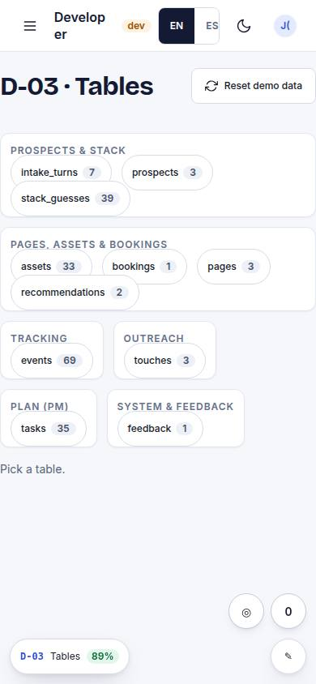
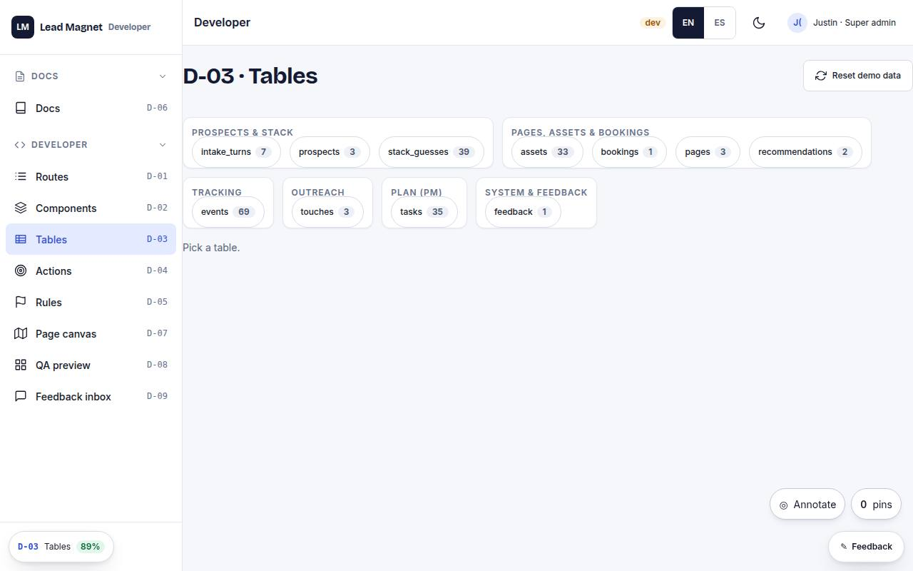

# D-03 · Tables

## Purpose

Browse any table: schema columns and seeded rows, live via useTable.

## Screenshots

| 390 | 1280 |
| --- | --- |
|  |  |

Dark: `../screenshots/D-03/390-dark.jpg`, `../screenshots/D-03/1280-dark.jpg` (key pages).

## Sections (layout order)

1. table list with counts
2. columns
3. rows

## Data

| Table | Read / write | Notes |
| --- | --- | --- |
| `prospects` | read | |
| `stack_guesses` | read | |
| `pages` | read | |
| `events` | read | |
| `bookings` | read | |
| `assets` | read | |
| `touches` | read | |
| `tasks` | read | |
| `feedback` | read | |

## Actions

| id | intent | permission |
| --- | --- | --- |
| `dev.openTable` | "open the {table} table" | `tables.read` |
| `dev.resetDb` | "reset the demo database" | `dev.tools` |

## Rules

- none yet

## Logic

- reads schema registry + DataProvider

## Components

DataTable, Badge, Chip

## Real vs mock

Built on the MockProvider (localStorage). Real data lands with Supabase (T44).

## Responsive check (P-01)

Checked at: 390, 1280.

## Changelog

- `docs/changelog/0001-foundation.md`
