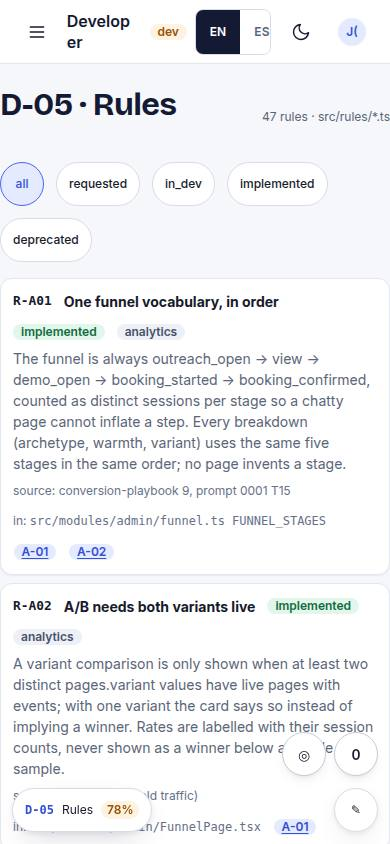
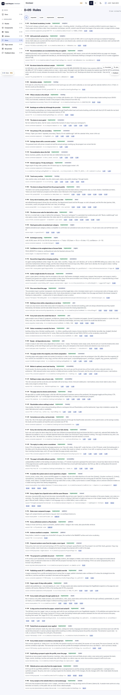

# D-05 · Rules

## Purpose

Business rules registry (R-xxx) with status, pages and where implemented.

## Screenshots

| 390 | 1280 |
| --- | --- |
|  |  |

Dark: `../screenshots/D-05/390-dark.jpg`, `../screenshots/D-05/1280-dark.jpg` (key pages).

## Sections (layout order)

1. filter
2. rules list

## Data

| Table | Read / write | Notes |
| --- | --- | --- |
| — | | no tables |

## Actions

| id | intent | permission |
| --- | --- | --- |
| `dev.filterRules` | "show {status} rules" | any |

## Rules

- none yet

## Logic

- globbed from src/rules/*.ts

## Components

Card, Badge, Chip

## Real vs mock

Built on the MockProvider (localStorage). Real data lands with Supabase (T44).

## Responsive check (P-01)

Checked at: 390, 1280.

## Changelog

- `docs/changelog/0001-foundation.md`
