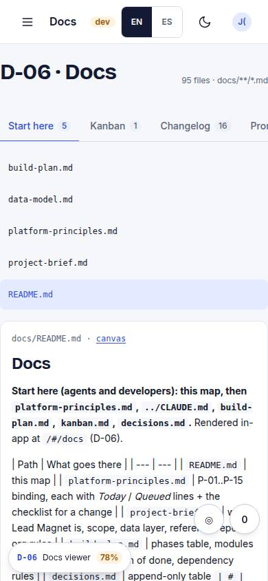
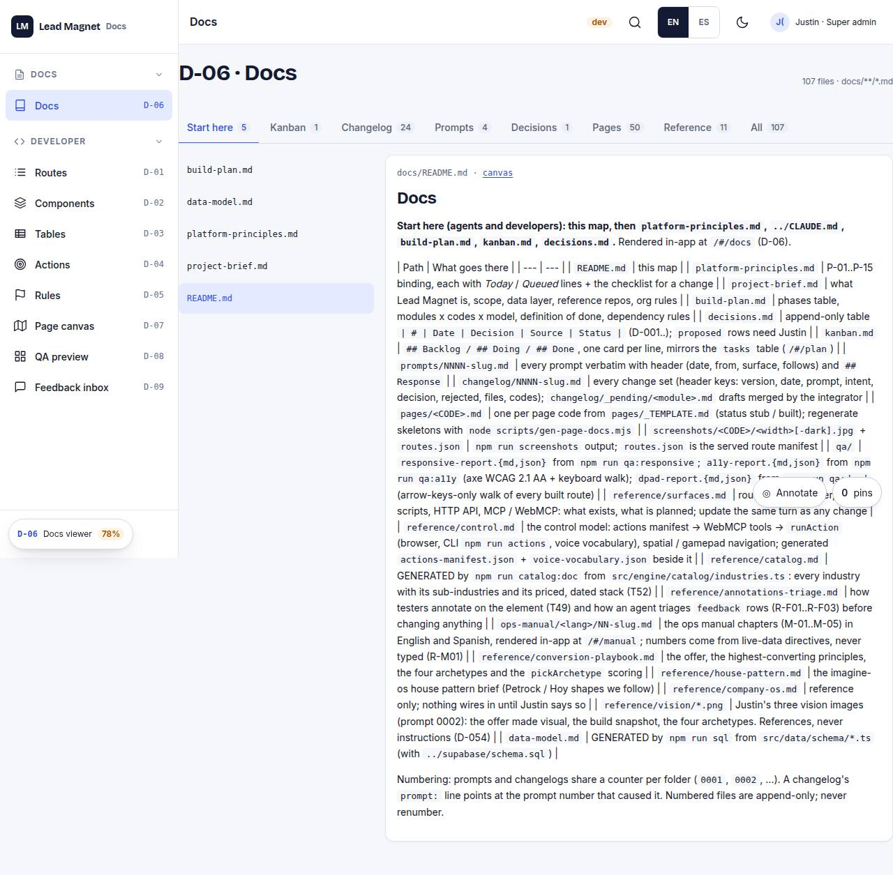

# D-06 · Docs viewer

## Purpose

Every docs/**/*.md rendered in-app with tabs for kanban, changelog, prompts, decisions, pages, reference.

## Screenshots

| 390 | 1280 |
| --- | --- |
|  |  |

Dark: `../screenshots/D-06/390-dark.jpg`, `../screenshots/D-06/1280-dark.jpg` (key pages).

## Sections (layout order)

1. tabs
2. file list
3. markdown

## Data

| Table | Read / write | Notes |
| --- | --- | --- |
| — | | no tables |

## Actions

| id | intent | permission |
| --- | --- | --- |
| `dev.openDoc` | "open the {doc} document" | `docs.read` |

## Rules

- none yet

## Logic

- import.meta.glob docs/**/*.md as raw

## Components

Tabs, Card

## Real vs mock

Built on the MockProvider (localStorage). Real data lands with Supabase (T44).

## Responsive check (P-01)

Checked at: 390, 1280.

## Changelog

- `docs/changelog/0001-foundation.md`
