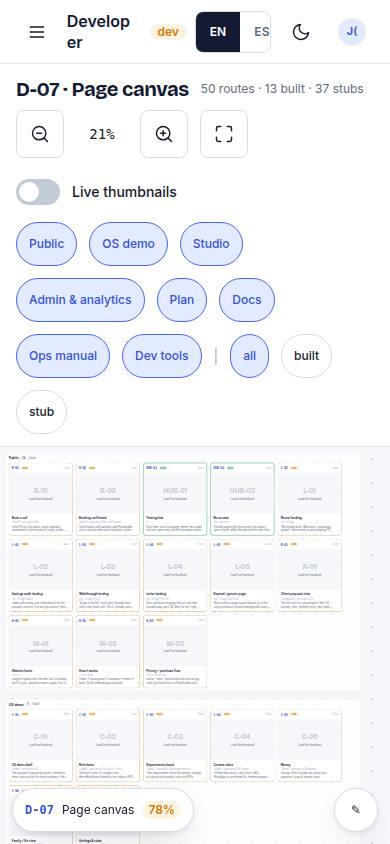
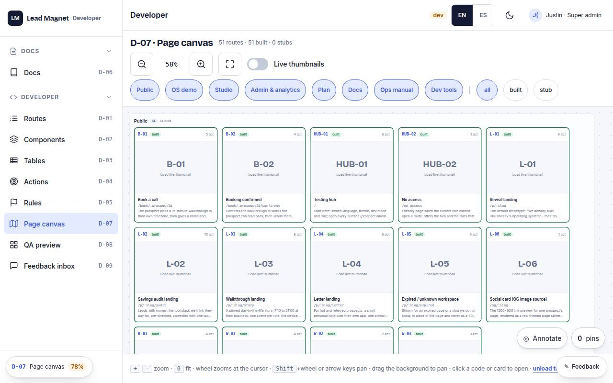

# D-07 · Page canvas

## Purpose

Zoomable, pannable canvas laying out every route as a card grouped by surface: code chip, status colour, live scaled iframe thumbnail on demand; click opens the page.

## Screenshots

| 390 | 1280 |
| --- | --- |
|  |  |

Dark: `../screenshots/D-07/390-dark.jpg`, `../screenshots/D-07/1280-dark.jpg` (key pages).

## Sections (layout order)

1. toolbar (zoom -, %, +, fit, thumbnails, surface filter)
2. canvas (groups by surface, cards)
3. legend / help

## Data

| Table | Read / write | Notes |
| --- | --- | --- |
| — | | no tables |

## Actions

| id | intent | permission |
| --- | --- | --- |
| `dev.canvasZoomIn` | "zoom in the canvas" | any |
| `dev.canvasZoomOut` | "zoom out the canvas" | any |
| `dev.canvasFit` | "fit the canvas" | any |
| `dev.canvasThumbnails` | "toggle live thumbnails" | any |
| `dev.canvasOpen` | "open page {code}" | any |

## Rules

- none yet

## Logic

- zoom: buttons, +/- keys, wheel; pan: arrow keys, drag, scrollbars (drag never the only way)
- thumbnails are same-origin iframes at 1280 scaled to the card

## Components

Button, IconButton, Chip, Badge, Tooltip, Card

## Real vs mock

Built on the MockProvider (localStorage). Real data lands with Supabase (T44).

## Responsive check (P-01)

Checked at: 390, 1280.

## Changelog

- `docs/changelog/0001-foundation.md`
- `docs/changelog/0023-integration-pass-3.md` (pass 3 integration: `.cv-view` is `data-spatial="skip"` - the canvas pans with the arrows itself and its inner controls stay out of the shell's focus grid, D-102)
