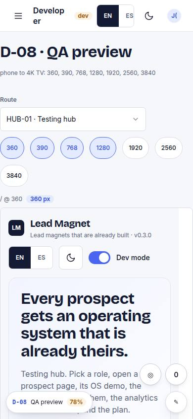
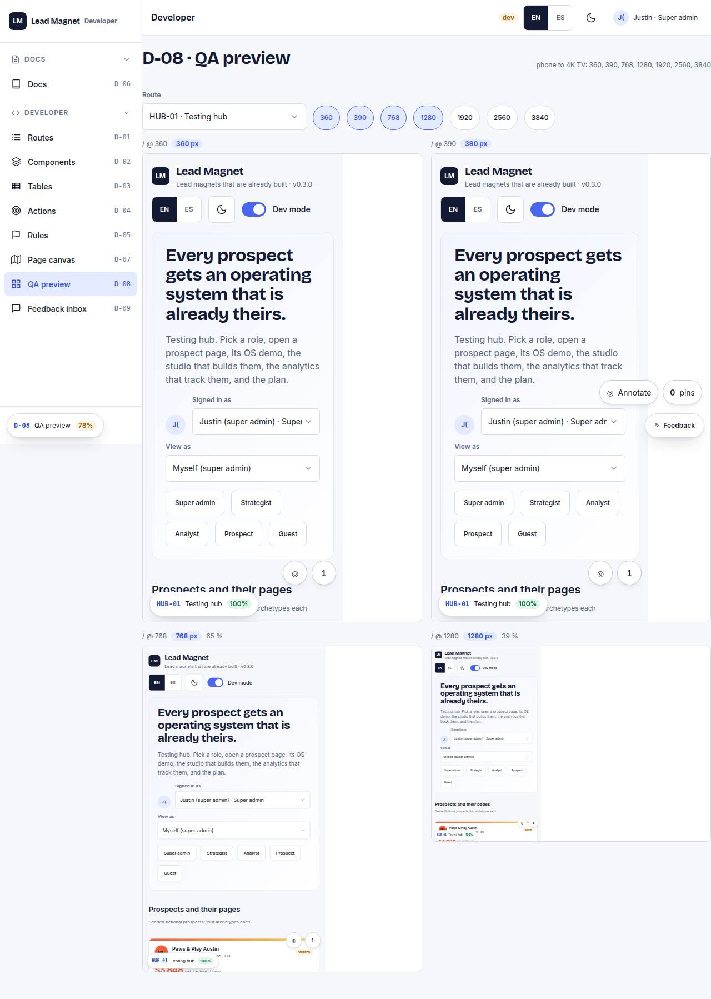

# D-08 · QA preview

## Purpose

Any route side by side at 360 / 390 / 768 / 1280 / 1920 / 2560 / 3840 in same-origin iframes scaled to fit.

## Screenshots

| 390 | 1280 |
| --- | --- |
|  |  |

Dark: `../screenshots/D-08/390-dark.jpg`, `../screenshots/D-08/1280-dark.jpg` (key pages).

## Sections (layout order)

1. route picker
2. width chips
3. frames

## Data

| Table | Read / write | Notes |
| --- | --- | --- |
| — | | no tables |

## Actions

| id | intent | permission |
| --- | --- | --- |
| `dev.previewRoute` | "preview {route} at every width" | any |

## Rules

- none yet

## Logic

- ViewportFrame scales with ResizeObserver

## Components

ViewportFrame, Select, Chip

## Real vs mock

Built on the MockProvider (localStorage). Real data lands with Supabase (T44).

## Responsive check (P-01)

Checked at: 390, 1280.

## Changelog

- `docs/changelog/0001-foundation.md`
