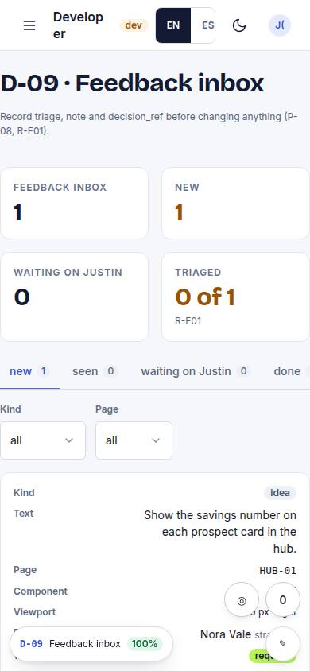
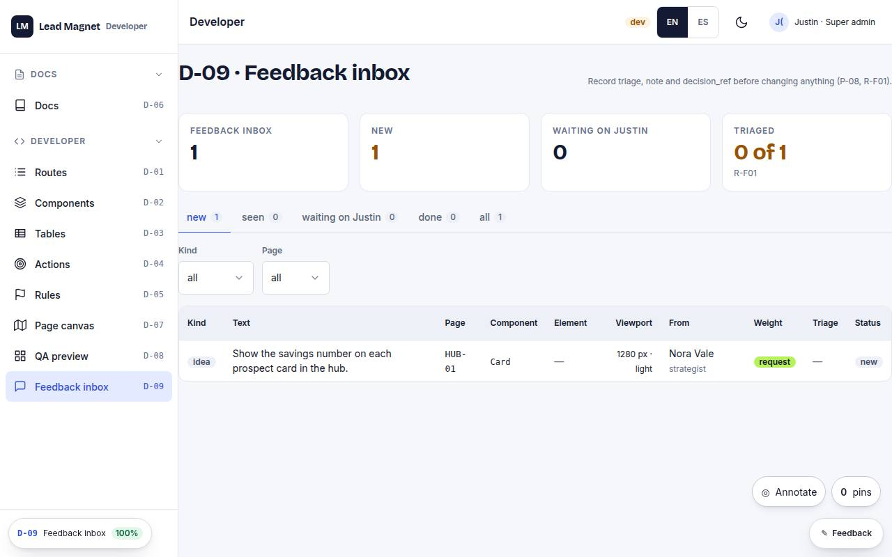

# D-09 · Feedback inbox

## Purpose

The annotations inbox and the place triage is recorded. Rows arrive from the `AnnotationLayer` (T49, every route) and the `FeedbackButton` (staff pages), carrying the element they were filed against, the library component (exact: every library component root carries `data-component="<Name>"`), the viewport and the theme. An agent reads `status = new`, weighs the author, writes `triage`, `triage_note` and `decision_ref` **before** changing anything (P-08, R-F01), then fixes in the same turn or sends the row to Justin.

## Screenshots

| 390 | 1280 |
| --- | --- |
|  |  |

Dark: `../screenshots/D-09/390-dark.jpg`, `../screenshots/D-09/1280-dark.jpg` (key pages).

## Sections (layout order)

1. KPI row - total, new, waiting on Justin, triaged / total (R-F01 coverage)
2. Status tabs (new / seen / waiting / done / all) with counts
3. Filters - kind, page
4. DataTable - kind, text, page, **component**, **element**, **viewport + theme**, from, **author weight**, triage, status
5. Triage panel (row editor) - the row in context, the suggested triage and its reason, triage / note / decision_ref / status / reply, and one "Needs Justin" button

## Data

| Table | Read / write | Notes |
| --- | --- | --- |
| `feedback` | read + write by id | `triage`, `triage_note`, `decision_ref`, `status`, `owner_reply` |

## Actions

| id | intent | permission |
| --- | --- | --- |
| `dev.triageFeedback` | "triage feedback {id} as {triage}" | `feedback.read` |
| `dev.setFeedbackStatus` | "mark feedback {id} {status}" | `feedback.read` |
| `dev.needsJustin` | "send feedback {id} to Justin" | `feedback.read` |
| `dev.filterFeedback` | "show {kind} feedback on {page} that is {status}" | `feedback.read` |

All four are declared in `src/modules/dev/specs.ts` and registered by the page while it is mounted; the spec also lists `rules: R-F01..R-F03` and `checkedAt` for every width.

## Rules

- `R-F01` - `triage` and `decision_ref` are written before anything changes; `status = done` is refused without them and says why in a toast.
- `R-F02` - author weight (binding / request / signal) is shown per row and drives the suggested triage.
- `R-F03` - pins on the page never block it (implemented in `AnnotationLayer`, surfaced here through `element_path`).

## Logic

- The `done` guard is the rule in code: `setStatus()` refuses `done` while `triage` or `decision_ref` is empty and pushes a toast naming R-F01.
- "Needs Justin" is one write: `triage = 'ask'`, `status = 'waiting'`.
- `authorWeight(role)` and `suggestedTriage(role, kind)` come from `src/rules/annotations.ts`, so the inbox, the pin thread and the reference doc cannot drift from each other.
- The element column shows the last segment of `element_path` with the full selector in `title`; the panel shows the whole chain.
- Every write goes through `useData().update('feedback', id, patch)` by id (P-14).

## Components

Tabs, DataTable, Select, Input, Button, Badge, Card, Field, Stat, Toast, EmptyState.

## Real vs mock

Real: the rows, the filters, the triage writes, the R-F01 guard, the author weighting. Mock: the store is the MockProvider in this browser, so annotations do not reach anyone else until Supabase (T44); there is one `owner_reply`, not a thread (needs its own table, T48); no screenshot is attached to a row (image capture is not wired, T40).

## Responsive check (P-01)

Checked at: 360, 390, 768, 1280, 1920, 2560, 3840. Under 768 px the DataTable stacks each row into a labelled card and the element column is dropped from the card view (`hideOnCard`); the triage panel drops below the table. Every control is a 44 px target and reachable by keyboard.

## Changelog

- `docs/changelog/0001-foundation.md`
- `docs/changelog/0012-annotations.md`
