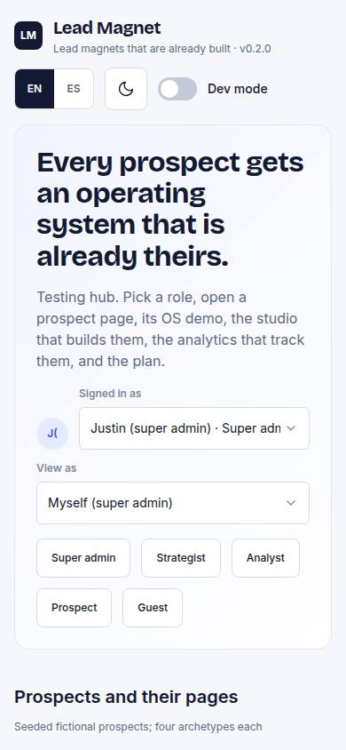
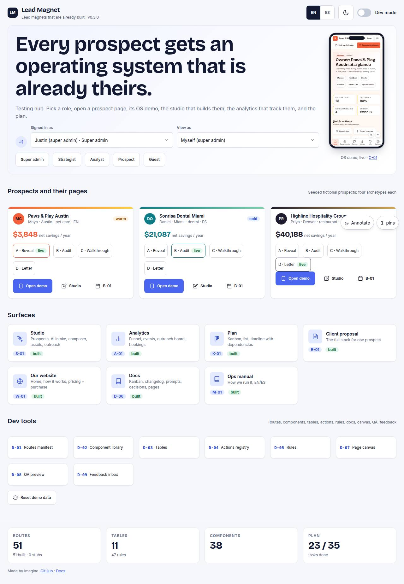

# HUB-01 · Testing hub

## Purpose

Start here: switch language, theme, dev mode and role; open every surface (prospect landing pages, OS demo live in a phone, studio, analytics, plan, proposal, website, docs, manual, dev tools) and see the build counts.

## Screenshots

| 390 | 1280 |
| --- | --- |
|  |  |

Dark: `../screenshots/HUB-01/390-dark.jpg`, `../screenshots/HUB-01/1280-dark.jpg` (key pages).

## Sections (layout order)

1. header (brand, Commands + Speak, EN/ES, theme, dev mode)
2. role switcher
3. prospects: landing pages per archetype + demo
4. OS demo in PhoneFrame
5. surface cards
6. dev tools D-01..D-09
7. counts footer

## Data

| Table | Read / write | Notes |
| --- | --- | --- |
| `prospects` | read | |
| `pages` | read | |
| `tasks` | read | |
| `feedback` | read | |

## Actions

| id | intent | permission |
| --- | --- | --- |
| `hub.setLang` | "switch language to {lang}" | any |
| `hub.toggleTheme` | "switch to dark mode" | any |
| `hub.toggleDevMode` | "turn dev mode on" | `dev.tools` |
| `hub.switchUser` | "sign in as {role}" | any |
| `hub.openSurface` | "open {surface}" | any |
| `hub.resetDemoData` | "reset the demo database" | `dev.tools` |
| `hub.openCommands` | "open the command palette" | any |
| `hub.voiceListen` | "listen for a voice command" (opens the palette; listens only inside a user gesture, else focuses the mic) | any |

## Rules

- `R-P01`
- `R-P02`

## Logic

- counts = routes / built / stubs / tables / rules / components from registries
- prospect cards read live pages and the savings from the composed model
- Commands / Speak open the `CommandPalette` (also Ctrl/Cmd+K on every shell); a typed or spoken phrase is ranked by `matchPhrase` (`src/a11y/voice.ts`) over `window.__leadmagnet.vocabulary`, role-gated with `can()`, and run through `runAction` (`docs/reference/control.md` §4)
- arrows / gamepad d-pad move focus (`useSpatialNav` + `useGamepadNav`); Escape inside the role `select` parks focus so the next arrow moves on

## Components

LangToggle, IconButton, Toggle, RoleSwitcher, PhoneFrame, Card, Badge, Stat, Button, Avatar, DeviceMockup, CommandPalette

## Real vs mock

Built on the MockProvider (localStorage). Real data lands with Supabase (T44).

## Responsive check (P-01)

Checked at: 390, 1280.

## Changelog

- `docs/changelog/0001-foundation.md`
- `docs/changelog/0010-control.md` (spatial nav, TV hint)
- `docs/changelog/0018-control.md` (Commands / Speak, hub.openCommands, hub.voiceListen)
- `docs/changelog/0023-integration-pass-3.md` (pass 3 integration: the Speak button uses the `mic` icon)
