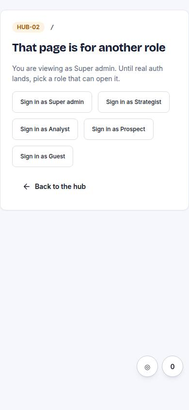
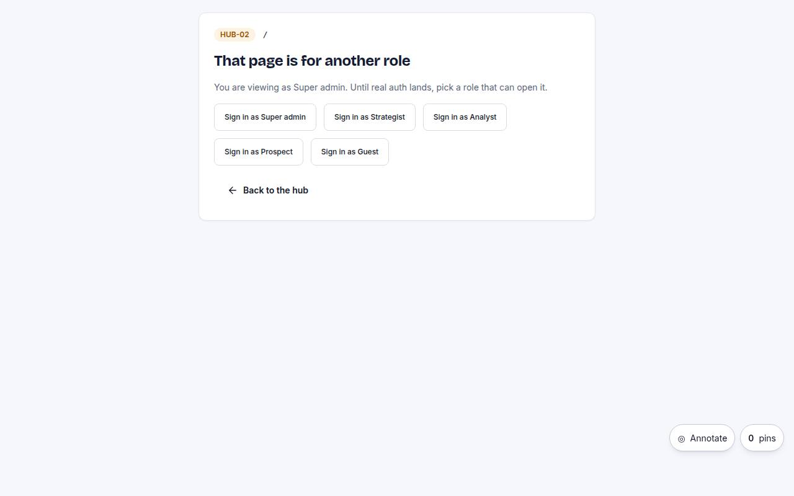

# HUB-02 · No access

## Purpose

Friendly page when the current role cannot open a route; offers the hub and the roles that can.

## Screenshots

| 390 | 1280 |
| --- | --- |
|  |  |

Dark: `../screenshots/HUB-02/390-dark.jpg`, `../screenshots/HUB-02/1280-dark.jpg` (key pages).

## Sections (layout order)

1. message
2. roles that can
3. hub link

## Data

| Table | Read / write | Notes |
| --- | --- | --- |
| — | | no tables |

## Actions

| id | intent | permission |
| --- | --- | --- |
| `hub.signInAs` | "sign in as {role}" | any |

## Rules

- none yet

## Logic

- reads ?from= and lists roles allowed on that route

## Components

Card, Button, Badge

## Real vs mock

Built on the MockProvider (localStorage). Real data lands with Supabase (T44).

## Responsive check (P-01)

Checked at: 390, 1280.

## Changelog

- `docs/changelog/0001-foundation.md`
- `docs/changelog/0023-integration-pass-3.md` (pass 3 integration: `useSpatialNav` + `useGamepadNav` on the page root, D-124)
