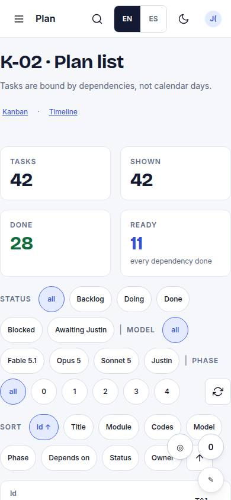
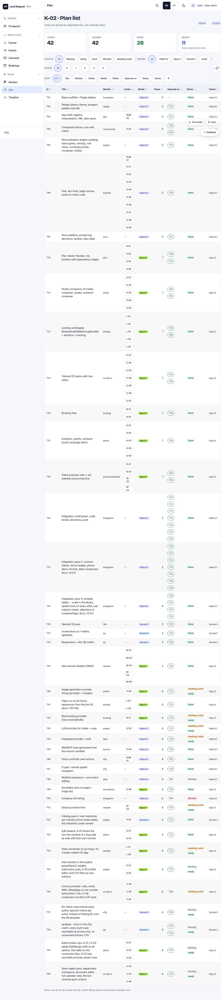

# K-02 · Plan list

## Purpose

Every task in one table, sortable on any column and filterable by status, model and phase. This is the view for "what does Sonnet 5 still owe us in phase 3" or "show me everything that depends on nothing". A row opens the task detail (K-04).

## Screenshots

| 390 | 1280 |
| --- | --- |
|  |  |

## Sections (layout order)

1. Head - title, tagline, links to K-01 / K-03
2. Counts - tasks, shown, done, ready
3. Filters - status chips, model chips, phase chips, clear button
4. Sort - one chip per column with the active direction arrow, plus a direction toggle
5. DataTable - id, title, module, codes, model, phase, depends on (linked ids), status (+ ready), owner

## Data

| Table | Read / write | Notes |
| --- | --- | --- |
| `tasks` | read | sorting and filtering are client-side over `useTable` rows |

## Actions

| id | intent | permission |
| --- | --- | --- |
| `plan.filter` | "show {phase} tasks for {model}" | - |
| `plan.sortList` | "sort the plan by {column}" | - |
| `plan.openTask` | "open task {task}" | - |

## Rules

- `R-K02` - the model column is a toned badge, never plain text.
- `R-K03` - the status filter offers exactly the five lanes.
- `R-K04` - the status cell carries a "ready" badge when every dependency is done.

## Logic

- Sorting: numeric columns (phase, dependency count) compare numerically, everything else by locale, ties broken by id; clicking the active column flips the direction.
- The `depends on` cell lists the dependency ids as links, green-bordered when that dependency is done and neutral when it is still open.
- Filters combine (AND); the "shown" count reports the result.

## Components

DataTable, Chip, Badge, Select, Stat, IconButton, EmptyState (through DataTable's empty state).

## Real vs mock

All real reads. The sort controls sit in a toolbar above the table because `DataTable.Column.header` is a string today - a request to foundation asks for `headerNode` / `sortable` so the header cells themselves can be the buttons.

## Responsive check (P-01)

Checked at 360, 390, 768, 1280, 1920, 2560, 3840. Under 768 px `DataTable` turns every row into a labelled card (owner is hidden on cards); the filter and sort chip rows wrap.

## Changelog

- `docs/changelog/0002-plan.md`
- `docs/changelog/0023-integration-pass-3.md` (pass 3 integration: header sort moved into `DataTable` (`sort` / `onSort`, 44 px buttons with `aria-sort`); the chip row stays as the card-mode (< 768) sort control; `plan.sortList` unchanged)
