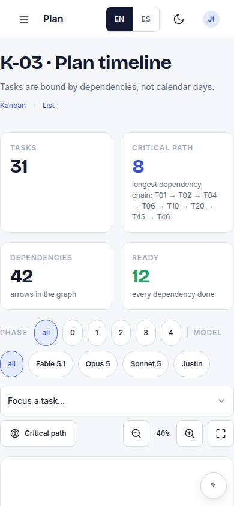
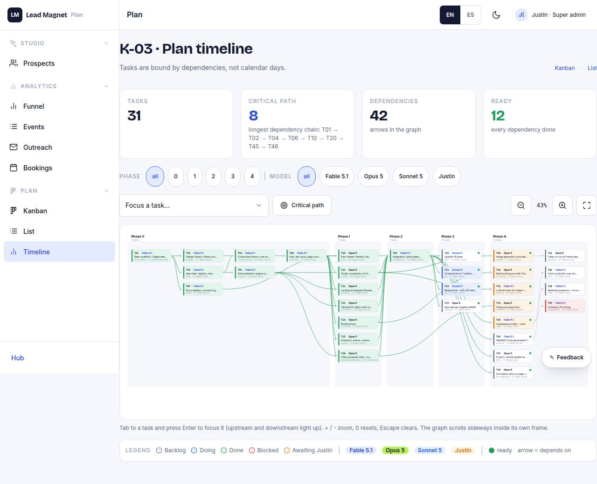

# K-03 · Plan timeline

## Purpose

Dependency graph: phases as columns, tasks as nodes, depends_on as edges (SVG); tasks are bound by dependencies, not calendar days.

## Screenshots

| 390 | 1280 |
| --- | --- |
|  |  |

Dark: `../screenshots/K-03/390-dark.jpg`, `../screenshots/K-03/1280-dark.jpg` (key pages).

## Sections (layout order)

1. phase columns
2. nodes
3. edges
4. legend

## Data

| Table | Read / write | Notes |
| --- | --- | --- |
| `tasks` | read | |

## Actions

| id | intent | permission |
| --- | --- | --- |
| `plan.focusTask` | "focus task {task}" | any |

## Rules

- none yet

## Logic

- (to be specified)

## Components

Card, Badge

## Real vs mock

Stub (PageStub). Built by module plan (T10)

## Responsive check (P-01)

Not checked yet.

## Changelog

- `docs/changelog/0001-foundation.md`
