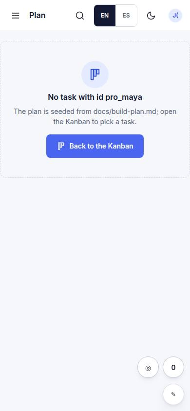
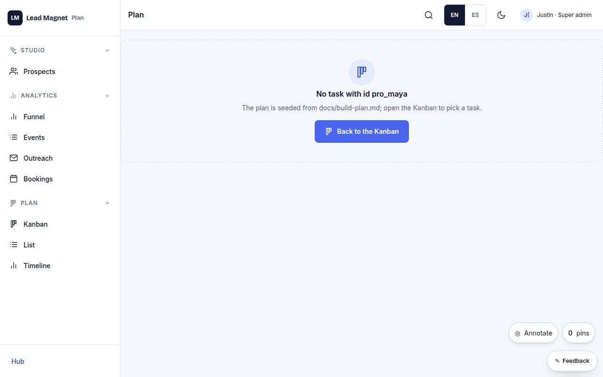

# K-04 · Task detail

## Purpose

One task: notes, codes, dependencies both ways, status change, model.

## Screenshots

| 390 | 1280 |
| --- | --- |
|  |  |

Dark: `../screenshots/K-04/390-dark.jpg`, `../screenshots/K-04/1280-dark.jpg` (key pages).

## Sections (layout order)

1. header
2. dependencies
3. notes
4. status

## Data

| Table | Read / write | Notes |
| --- | --- | --- |
| `tasks` | read | |

## Actions

| id | intent | permission |
| --- | --- | --- |
| `plan.setStatus` | "set {task} to {status}" | `plan.edit` |

## Rules

- none yet

## Logic

- (to be specified)

## Components

Card, Select, Badge

## Real vs mock

Stub (PageStub). Built by module plan (T10)

## Responsive check (P-01)

Not checked yet.

## Changelog

- `docs/changelog/0001-foundation.md`
