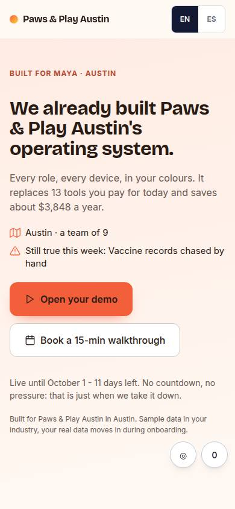
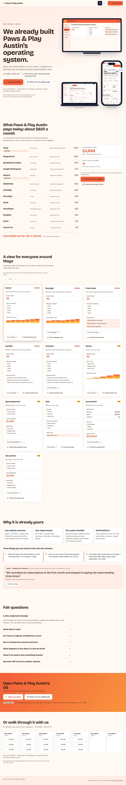

# L-01 · Reveal landing

## Purpose

The default archetype and the page most cold and warm traffic lands on. A prospect clicks a link from an outreach message and, before scrolling, sees their business name, their city, their palette and their operating system already running on a phone, a laptop and the TV in their back office. Below that: the tool stack it replaces with the prices struck through, a view for every role in their business and their life, why it is already theirs, the fair questions, and two ways forward - open the demo (never gated) or pick a slot from the calendar embedded on the page.

## Screenshots

| 390 | 1280 |
| --- | --- |
|  |  |

The committed images are the foundation's PageStub shots and are now stale; T31 recaptures every L- page (light + dark, 390 / 1280). Verified live at 360, 390, 768, 1280, 1920, 2560 and 3840 during this pass: no horizontal overflow, no body text under 12 px, headline 32 px at 360 and 153 px at 3840.

## Sections (layout order)

1. **Top bar** - business-name wordmark, EN / ES, primary CTA. The page owns its chrome; `shells.tsx` puts no shell on a `public` surface.
2. **hero_reveal** - eyebrow, headline, subline, both CTAs, and three DeviceMockups (phone, laptop, TV) each holding a themed mini OS built from the role views in the model. Revealed by scroll progress.
3. **savings_stack** - one row per guessed tool, the price struck through as the row arrives, and a count-up of the net annual saving plus "N tools you can cancel".
4. **role_views** - a card per business and life role with its three widgets; scroll-snap carousel on a phone, grid from 768 up, prev / next and arrow keys everywhere.
5. **proof** - four facts about this prospect, then an honestly-labelled sample testimonial and logo strip.
6. **faq** - three disclosure questions.
7. **cta_band** - repeated primary CTA, secondary CTA, and the real expiry date.
8. **booking_inline** - next seven days, three slots a day, deep-linking B-01.
9. **Sticky CTA (phone)** - slides in once the hero has scrolled past.
10. **Exit intent modal** - once per session, offers the call.
11. **Save your workspace modal** - name + email, only after a demo open or a long press on the sticky CTA.

## Data

| Table | Read / write | Notes |
| --- | --- | --- |
| `pages` | read | by `slug`; `status`, `expires_at`, `model` (the PageModel snapshot this page renders) |
| `prospects` | read | palette, font, names, city - for `prospectStyle()` and the mini OS |
| `stack_guesses` | read | live rows; a rejection made on L-02 lowers this page's savings number too |
| `events` | write | `view`, `section_view`, `scroll_depth`, `cta_click`, `demo_open`, `booking_started`, `exit_intent`, `form_submit` |

## Actions

| id | intent | permission |
| --- | --- | --- |
| `landing.openDemo` | "open {business} demo" | `demo.open` |
| `landing.bookCall` | "book a walkthrough call" | `booking.create` |
| `landing.saveWorkspace` | "save my workspace with my email" | — |
| `landing.setLang` | "switch language to {lang}" | — |
| `landing.viewRole` | "show me the {role} view" | — |
| `landing.tryAsRole` | "open the demo as the {role}" | `demo.open` |
| `landing.toggleFaq` | "answer {question}" | — |
| `landing.seeCaseStudy` | "show me a case study" | — (Placeholder) |
| `landing.pickSlot` | "book {slot}" | `booking.create` |

## Rules

- `R-C01` - the demo opens with one click; the only form is the optional "save your workspace" modal, and only after a demo open.
- `R-C02` - one primary CTA (top bar, hero, savings, CTA band, sticky) and one secondary with the calendar inline, never a link-out.
- `R-C03` - the guessed stack with struck-through prices and a counting-up annual number.
- `R-C04` - the urgency line shows the real `expires_at` in days and as a date.
- `R-C05` - an expired or unknown slug renders L-05 in place, never a 404.
- `R-C06` - every section emits one `section_view`.
- `R-L01`..`R-L05` - snapshot rendering, optional motion, no swipe-only or hover-only controls, own chrome and theme, honest placeholders.

## Logic

- `booking_inline` renders `previewSlots(slotGrid(prospect.id, tzForProspect(prospect)))` from `src/engine/slots.ts`: three free slots per open day in the prospect's timezone, every one of them a real B-01 slot; picking one deep-links `/book/:id?slot=<ISO>` (D-051). The page opens in `prospects.lang` unless the viewer chose EN / ES (D-034).

- `usePageModel(slug, 'reveal')` reads the `pages` row by slug and returns `live | expired | missing`. Expired is `status = expired` or `expires_at` in the past.
- The page renders `pages.model.sections` in order. It recomposes only when the snapshot was composed for a different archetype - `composePage(prospect, 'reveal', { pageId, slug, guesses, expiresAt })` - so all four variants work for every seeded slug.
- `useScrollFrames(count)` maps the hero section's own scroll travel to a frame index. With a generated sequence (`public/frames/<prospectId>/`, 24 phone + 12 desktop frames from `npm run frames`) the phone and the laptop play real captures of this prospect's demo and the TV keeps the live composition; without one, all three render `<MiniOs>` as before. The hook returns both `progress` (the CSS reveal, unchanged) and `scrub` (the section mapped to 0..1, which is what the frames use), and reduced motion holds frame 0.
- Exit intent: on a fine pointer, the pointer leaving through the top of the viewport; on a coarse pointer, the back gesture (a pushed history entry) or 45 s idle. Once per session, recorded in `sessionStorage`.
- Every animation is inside `@media (prefers-reduced-motion: no-preference)`; with reduced motion the page is fully visible and every number final on first paint.

## Components

DeviceMockup, Stat, Button, IconButton, Card, Badge, Modal, Field, Input, LangToggle, Placeholder, Toast, Avatar.

## Real vs mock

Real: the page model, the savings maths, the role views, the theming, every event, the stack corrections, the request-a-workspace row. Mocked or not wired: generated hero / device imagery (T40, T41 - today the devices hold a live CSS composition, not a render), the case study (Placeholder), the testimonial and logo strip (labelled a sample), sending the saved workspace email (the event is written, nothing is sent), and availability in the inline grid (B-01 owns booking).

## Responsive check (P-01)

Checked at 360, 390, 768, 1280, 1920, 2560, 3840. Hero goes one column under 1100; the three devices stack under 700; role cards become a snap carousel under 768; the sticky CTA only exists under 768; the booking grid becomes seven fixed columns at 2560+. No horizontal overflow at any width (`overflow-x: clip` on sections absorbs the device frames' few-pixel bleed without breaking `position: sticky`).

## Pass 2 (v0.3.0) — what changed

- **Real video-on-scroll.** `npm run frames` walks the live OS demo for each seeded prospect and writes
  `public/frames/<prospectId>/` — 24 phone frames (390 × 844) and 12 desktop frames (1280 × 800), ~1.5 MB a prospect.
  `useFrames(prospectId)` loads `index.json`, preloads the images and returns `null` when a sequence does not exist, so
  every device silently falls back to the live `<MiniOs>` composition. `useScrollFrames(count)` now returns a second
  measurement, `scrub`, that maps the **section** to 0..1 (0 with its top at the top of the viewport, 1 when its bottom
  reaches the bottom); `progress` still drives the CSS reveal, so the devices are visible on first paint. Reduced motion
  holds the first frame.
- **A/B by visitor.** A slug may now have more than one live `pages` row. `pickPageVariant()` hashes `sessionId()` with
  the slug and picks one deterministically: stable for the whole visit, spread across visitors, no cookie and no random
  flip. `?variant=A|B` forces one (the studio's preview links). Every event carries
  `{ variant, page_id, archetype, slug, variants, variant_forced }` in its meta.
- **Per-page meta.** `usePageMeta()` sets `document.title` ("&lt;Business&gt;'s operating system, already built"),
  `meta[name=description]` and the `og:*` / `twitter:*` tags per prospect and language, with `og:image` pointing at
  `public/og/<slug>.jpg` (L-06, `npm run og`). Limitation: a HashRouter route cannot give a non-JS crawler per-page
  tags; static prerender of `/p/<slug>` is proposed as a later task.
- **Conversion polish.** Two personal facts above the fold (city + team, and the top pain from the industry catalog);
  the savings rows cross themselves out in sequence with a running total **in text** ("Cancelled so far: $769 a month ·
  10 of 13 tools crossed off"); every role card ends in "Try it as &lt;role&gt;" opening `/demo/:id/role/:slug`; the proof
  sample is labelled "Sample, not a customer" with the logo strip named as placeholder marks; the phone sticky CTA
  carries the savings number; the exit-intent modal offers six real slots inline instead of a link.

## Changelog

- `docs/changelog/0004-landing.md`
- `docs/changelog/_pending/landing.md` (v0.3.0, pass 2)
