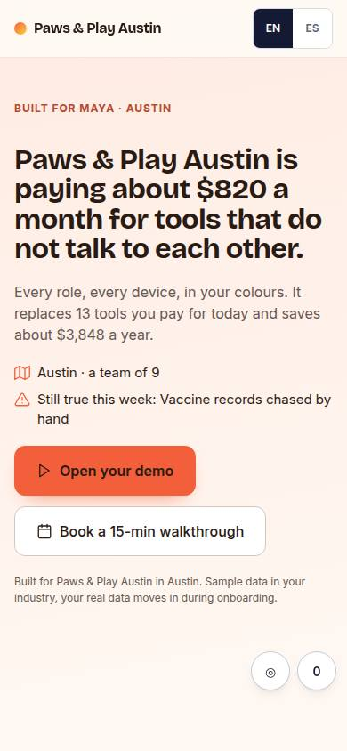
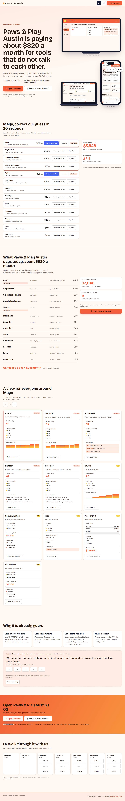

# L-02 · Savings audit landing

## Purpose

Leads with money: pre-checked tool list the prospect corrects, live savings counter, then the reveal.

## Screenshots

| 390 | 1280 |
| --- | --- |
|  |  |

Dark: `../screenshots/L-02/390-dark.jpg`, `../screenshots/L-02/1280-dark.jpg` (key pages).

## Sections (layout order)

1. hero (money headline)
2. stack_audit
3. savings_stack (live counter)
4. role_views
5. proof
6. cta_band
7. booking_inline

## Data

| Table | Read / write | Notes |
| --- | --- | --- |
| `pages` | read | |
| `prospects` | read | |
| `stack_guesses` | read | |
| `events` | read | |

## Actions

| id | intent | permission |
| --- | --- | --- |
| `landing.confirmTool` | "confirm we use {tool}" | any |
| `landing.rejectTool` | "reject {tool}" | any |
| `landing.openDemo` | "open {business} demo" | any |
| `landing.bookCall` | "book a walkthrough call" | any |

## Rules

- none yet

## Logic

- (to be specified)

## Components

DataTable, Chip, Stat, DeviceMockup, Button

## Real vs mock

Stub (PageStub). Built by module landing (T12)

## Responsive check (P-01)

Not checked yet.

## Changelog

- `docs/changelog/0001-foundation.md`
