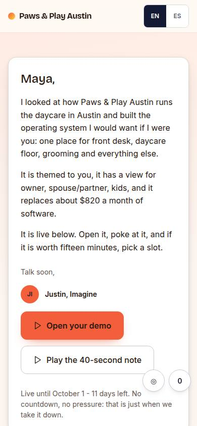
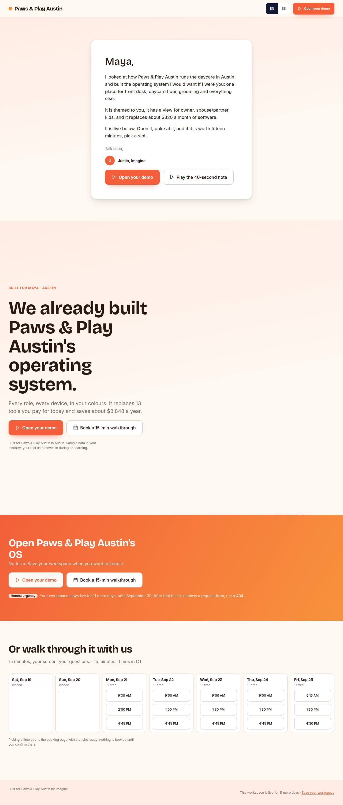

# L-04 · Letter landing

## Purpose

For hot and referred prospects, where a human has already spoken to them. A short personal note on a card, the sender's name and avatar, one primary CTA - and their own app revealed underneath it. Shortest of the four pages on purpose: the relationship is the proof, so there is no testimonial section to pad it out.

## Screenshots

| 390 | 1280 |
| --- | --- |
|  |  |

Not yet captured (T31). Verified live at all seven widths during this pass.

## Sections (layout order)

1. Top bar
2. **letter** - greeting, three paragraphs, sign-off, sender, primary CTA and the voice-note Placeholder
3. **hero_reveal** - their app on phone, laptop and TV behind the letter
4. **cta_band**
5. **booking_inline**
6. Sticky CTA (phone), exit intent modal, save-workspace modal

## Data

| Table | Read / write | Notes |
| --- | --- | --- |
| `pages` | read | by slug |
| `prospects` | read | theme, name, roles |
| `events` | write | the full tracking contract |

## Actions

| id | intent | permission |
| --- | --- | --- |
| `landing.openDemo` | "open {business} demo" | `demo.open` |
| `landing.bookCall` | "book a walkthrough call" | `booking.create` |
| `landing.saveWorkspace` | "save my workspace with my email" | — |
| `landing.setLang` | "switch language to {lang}" | — |
| `landing.playLetter` | "play the voice note" | — (Placeholder) |
| `landing.pickSlot` | "book {slot}" | `booking.create` |

## Rules

`R-C01`, `R-C02`, `R-C04`, `R-C05`, `R-C06`, `R-L01`, `R-L02`, `R-L04`, `R-L05`.
- `R-L08` - the expiry is a date plus days left, beside every CTA, never a countdown.
- `R-L09` - arrow keys, a remote d-pad and a gamepad reach every control.

## Logic

- `booking_inline` renders `previewSlots(slotGrid(prospect.id, tzForProspect(prospect)))` from `src/engine/slots.ts`: three free slots per open day in the prospect's timezone, every one of them a real B-01 slot; picking one deep-links `/book/:id?slot=<ISO>` (D-051). The page opens in `prospects.lang` unless the viewer chose EN / ES (D-034).

- Same resolution and recomposition path as L-01; only the section order differs (the engine puts `letter` first).
- The letter's sender comes from `ComposeOpts.from` (default "Justin, Imagine").
- The voice note is a Placeholder, not a fake player: nothing has been recorded, and a waveform that does nothing would be the one dishonest thing on the page (P-09).

## Components

Avatar, DeviceMockup, Button, Placeholder, Modal, LangToggle.

## Real vs mock

Real: the letter copy (engine-composed, EN + ES), the app behind it. Mocked: the voice / video note (Placeholder), the sender's photo (initials avatar until assets land).

## Responsive check (P-01)

Checked at 360, 390, 768, 1280, 1920, 2560, 3840. The letter card is capped at 68ch and its padding scales from 24 px to 64 px × `--scale`.

## Pass 2 (v0.3.0) — what changed

- **Real video-on-scroll.** `npm run frames` walks the live OS demo for each seeded prospect and writes
  `public/frames/<prospectId>/` — 24 phone frames (390 × 844) and 12 desktop frames (1280 × 800), ~1.5 MB a prospect.
  `useFrames(prospectId)` loads `index.json`, preloads the images and returns `null` when a sequence does not exist, so
  every device silently falls back to the live `<MiniOs>` composition. `useScrollFrames(count)` now returns a second
  measurement, `scrub`, that maps the **section** to 0..1 (0 with its top at the top of the viewport, 1 when its bottom
  reaches the bottom); `progress` still drives the CSS reveal, so the devices are visible on first paint. Reduced motion
  holds the first frame.
- **A/B by visitor.** A slug may now have more than one live `pages` row. `pickPageVariant()` hashes `sessionId()` with
  the slug and picks one deterministically: stable for the whole visit, spread across visitors, no cookie and no random
  flip. `?variant=A|B` forces one (the studio's preview links). Every event carries
  `{ variant, page_id, archetype, slug, variants, variant_forced }` in its meta.
- **Per-page meta.** `usePageMeta()` sets `document.title` ("&lt;Business&gt;'s operating system, already built"),
  `meta[name=description]` and the `og:*` / `twitter:*` tags per prospect and language, with `og:image` pointing at
  `public/og/<slug>.jpg` (L-06, `npm run og`). Limitation: a HashRouter route cannot give a non-JS crawler per-page
  tags; static prerender of `/p/<slug>` is proposed as a later task.
- **Conversion polish.** Two personal facts above the fold (city + team, and the top pain from the industry catalog);
  the savings rows cross themselves out in sequence with a running total **in text** ("Cancelled so far: $769 a month ·
  10 of 13 tools crossed off"); every role card ends in "Try it as &lt;role&gt;" opening `/demo/:id/role/:slug`; the proof
  sample is labelled "Sample, not a customer" with the logo strip named as placeholder marks; the phone sticky CTA
  carries the savings number; the exit-intent modal offers six real slots inline instead of a link.

## Pass 3 (v0.4.0) — what changed

- **Honest expiry inside the letter.** The line sits directly under the letter's own CTA row and again in the CTA
  band and under the booking grid: "Live until September 30 - 11 days left." A personal note with a countdown timer
  under it stops being a personal note (R-L08).
- **Length left alone, deliberately.** Three paragraphs is already the shortest archetype and the one sent only after
  a human has spoken to them; the pass added no copy here beyond the expiry line.
- **The voice note is still a `Placeholder`** (`landing.playLetter`) - recording it is the content pass, and a fake
  waveform would be the one dishonest thing on the page (P-09, R-L05).
- **Exit intent on touch** adds the fast flick back up the page; **spatial navigation** is wired on the page root.

## Responsive check (P-01) — pass 3

Re-measured in a real browser at 360, 390, 768, 1280, 1920, 2560 and 3840 on 2026-09-19 (`checkedAt` in the spec).
`documentElement.scrollWidth - clientWidth` is **0 at every width** on all five pages. The headline renders
32 / 32 / 43 / 68 / **108 / 143 / 176** px and the savings `Stat` value 40 / 40 / 40 / 40 / **80 / 108 / 150** px:
before this pass both stopped growing at 1920, because the clamp maxima (`68px * --scale`) were below what the
`vw` term already asked for. Nothing on the page is under 12 px.

## Changelog

- `docs/changelog/0004-landing.md`
- `docs/changelog/0014-landing-pass-2.md`
- `docs/changelog/0019-landing-pass-3.md` (v0.4.0, pass 3)
- `docs/changelog/0023-integration-pass-3.md` (pass 3 integration: a `faq` section with the switching objections is composed for the letter archetype too, D-109)
