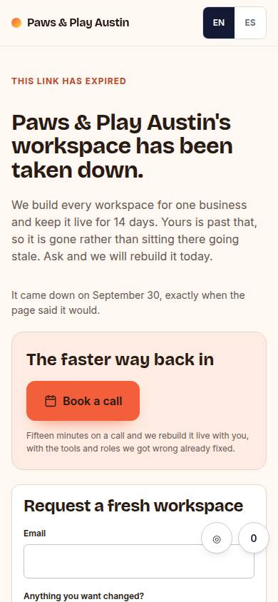
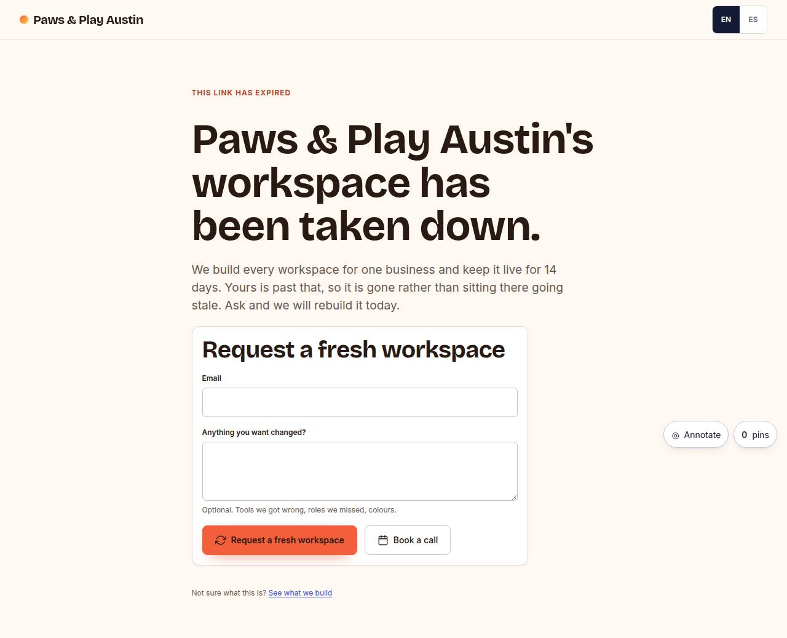

# L-05 · Expired / unknown workspace

## Purpose

Where an expired link and a mistyped link both land. A workspace is live for fourteen days; after that the page says so plainly, in the prospect's own palette when we still know whose link it was, and offers the two things that are still useful: ask for a fresh workspace, or book a call. It is rendered **in place** of L-01..L-04 whenever the page is missing or expired, so a landing link never 404s and never redirects somewhere confusing.

## Screenshots

| 390 | 1280 |
| --- | --- |
|  |  |

Not yet captured (T31). Verified live at all seven widths during this pass, for both an expired page and an unknown slug.

## Sections (layout order)

1. Top bar (prospect wordmark when known, otherwise "Imagine")
2. Honest message - what happened and why
3. Request card - email (validated) + optional note, or the confirmation once sent
4. Book a call - real when the prospect is known, a Placeholder when the slug is unknown (B-01 needs a prospect id)
5. A link to our website

## Data

| Table | Read / write | Notes |
| --- | --- | --- |
| `pages` | read | to find the prospect behind an expired slug |
| `prospects` | read | palette and business name |
| `feedback` | **write** | one row: `kind: request`, `page_code: L-05`, `status: new`, the slug and the email in `text` |
| `events` | write | `form_submit { form: 'request_workspace' }` |

## Actions

| id | intent | permission |
| --- | --- | --- |
| `landing.requestRefresh` | "request a new workspace" | — |
| `landing.bookCall` | "book a walkthrough call" | `booking.create` |
| `landing.setLang` | "switch language to {lang}" | — |

## Rules

- `R-C05` - expired pages never 404.
- `R-L05` - booking without a workspace link is a Placeholder rather than a guess at whose calendar to open.
- `R-L08` - it names the date the page actually came down, and offers the booking as the second chance.

## Logic

- `isExpired(page)` = `status === 'expired'` or `expires_at` in the past; the same helper the four landing pages use.
- The request writes a real `feedback` row, so it appears in the studio's triage inbox (D-09) next to tester annotations, with the viewport and theme recorded.
- The email is validated before the write; the form then collapses to a confirmation rather than clearing.

## Components

Card, Field, Input, Textarea, Button, Placeholder, LangToggle, Toast.

## Real vs mock

Real: the feedback row, the event, the palette. Mocked: nothing is emailed - a strategist picks the request up in the studio.

## Responsive check (P-01)

Checked at 360, 390, 768, 1280, 1920, 2560, 3840. Single column, 78ch cap, request card 62ch.

## Pass 2 (v0.3.0) — what changed

- Unchanged in substance. It now renders for an *expired* slug even when another live row exists for that slug, because
  `usePageModel` picks among the live rows first and only falls back to an expired one when none is live.
- The modal / control repaint rules it shares with L-01..L-04 gained a wrapping modal footer on phones.

## Pass 3 (v0.4.0) — what changed

- **The second chance is the booking, and it leads.** "The faster way back in" is now its own block above the request
  form, with the calendar CTA at `lg` size and the line "Fifteen minutes on a call and we rebuild it live with you,
  with the tools and roles we got wrong already fixed." It used to be the outline button beside the form's submit.
- **It navigates through the same handler the live pages use**, so `cta_click { cta: 'secondary' }` and
  `booking_started` are written before `/book/:id` opens; previously the `landing.bookCall` action only returned a
  string and just the `<Link>` worked.
- **The honest-expiry promise is kept on the way out:** when we still know the page, the header says "It came down on
  September 8, exactly when the page said it would" (R-L08).
- **L-05 emits a `view` event**, once per session per slug, like every other page (R-C06).
- Unknown slug is unchanged: the same page without a palette, and the booking CTA is a `Placeholder` because there is
  no prospect to book with.

## Responsive check (P-01) — pass 3

Re-measured in a real browser at 360, 390, 768, 1280, 1920, 2560 and 3840 on 2026-09-19 (`checkedAt` in the spec).
`documentElement.scrollWidth - clientWidth` is **0 at every width** on all five pages. The headline renders
32 / 32 / 43 / 68 / **108 / 143 / 176** px and the savings `Stat` value 40 / 40 / 40 / 40 / **80 / 108 / 150** px:
before this pass both stopped growing at 1920, because the clamp maxima (`68px * --scale`) were below what the
`vw` term already asked for. Nothing on the page is under 12 px.

## Changelog

- `docs/changelog/0004-landing.md`
- `docs/changelog/0014-landing-pass-2.md`
- `docs/changelog/0019-landing-pass-3.md` (v0.4.0, pass 3)
- `docs/changelog/0023-integration-pass-3.md` (pass 3 integration: `useSpatialNav` + `useGamepadNav` wired like L-01..L-04 (Back = top of the page), D-124)
