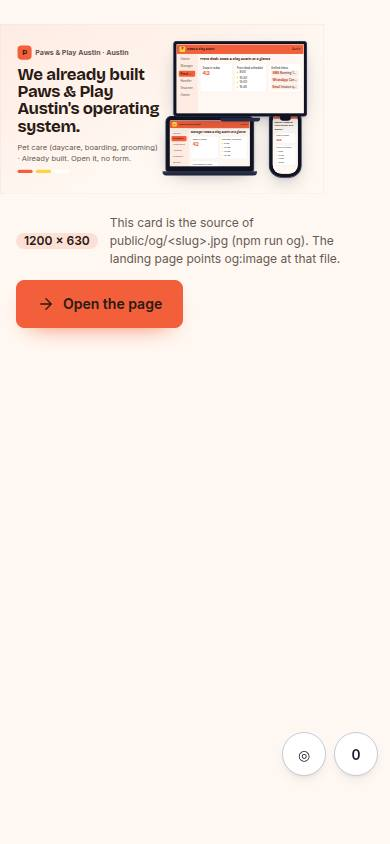
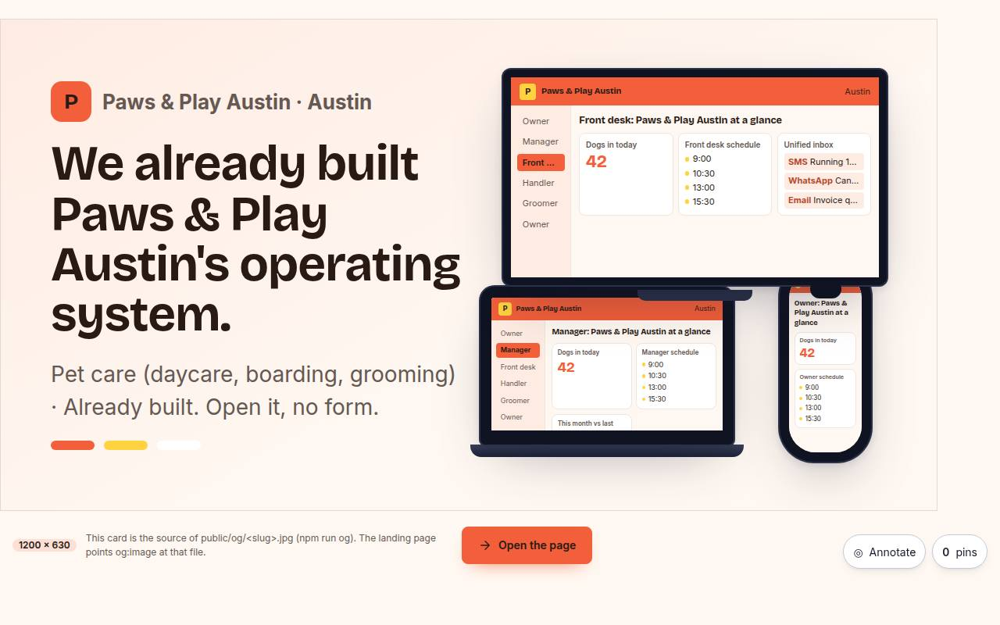

# L-06 · Social card (OG image source)

## Purpose

The 1200 × 630 link preview for one prospect's page, rendered as a real themed page rather than drawn by hand. When someone pastes `/#/p/paws-and-play-austin` into Slack, WhatsApp or LinkedIn, the unfurl should already be about *them*: their business name, their city, the headline from their own `PageModel`, their palette, and their OS on three devices. `npm run og` screenshots the `.og-card` element at exactly 1200 × 630 to `public/og/<slug>.jpg`, and the landing page points `og:image` at that file at runtime. The route is not linked from anywhere a prospect can reach; a human who opens it gets the card, a caption explaining what it is, and a button to the page itself.

## Screenshots

| 390 | 1280 |
| --- | --- |
|  |  |

The card itself, as captured for the seeded prospects, is `public/og/<slug>.jpg` (three files, ~60–90 KB each).

## Sections (layout order)

1. **`.og-fit` → `.og-card`** — the fixed 1200 × 630 card: eyebrow (mark, business, city), the hero headline from the published model, the industry line, three palette swatches, and phone / laptop / TV `DeviceMockup`s holding the mini OS.
2. **Caption row** — a `1200 × 630` badge, one line saying where the file goes, and **Open the page**. Outside the capture, because `npm run og` screenshots the card element, not the viewport.

## Data

| Table | Read / write | Notes |
| --- | --- | --- |
| `pages` | read | by `slug`; `model` supplies the headline so the card and the page never disagree |
| `prospects` | read | palette, font, business name, city, industry |

## Actions

| id | intent | permission |
| --- | --- | --- |
| `landing.openPage` | "open the landing page this card previews" | — |

## Rules

- `R-L04` — the card is themed through `--lp-*` from `prospectStyle()`; no token is forked per prospect.
- `R-L05` — an unknown slug renders a neutral Imagine card and says so, rather than erroring (the same spirit as R-C05).

## Logic

- The card is laid out at a literal `1200px × 630px` and scaled by `--og-scale: min(1, (100vw - 32px) / 1200)` inside `.og-fit`, whose height follows the scale. That is what lets one element be both a phone-safe page (no horizontal scrollbar at 360) and an exact-size capture target: `scripts/og.mjs` opens a 1240 × 760 viewport, where the scale resolves to 1, and calls `element.screenshot()`.
- The headline is `pages.model.sections.find(kind === 'hero_reveal').headline`, resolved in the viewer's language, so a Spanish-first prospect's card is Spanish.
- `scripts/og.mjs` takes its slug list from the seeded database the running app holds (`localStorage['leadmagnet.db.v1']`), never from a list maintained by hand; `--slugs=` overrides it.

## Components

DeviceMockup, Badge, Button (plus the module's `MiniOs` composition).

## Real vs mock

Real: the card, the capture script, the file, and the `og:image` tag the landing page sets. **Known limitation:** the app is a HashRouter SPA, so a crawler that does not execute JavaScript sees `index.html`'s tags for every prospect and will not pick these up. Fixing that properly means prerendering `/p/<slug>` to static HTML at build time — proposed as a later task in `docs/changelog/0019-landing-pass-3.md`. Until then the tags are right for the tab, the history, bookmarks, and every preview bot that runs the page.

## Responsive check (P-01)

Checked at 360, 390, 768, 1280, 1920, 2560, 3840. The card scales as one block, so its internal proportions are identical at every width and nothing reflows; below 1232 px it is smaller, never rearranged. No horizontal overflow at any width.

## Changelog

- `docs/changelog/0019-landing-pass-3.md` (v0.3.0)
