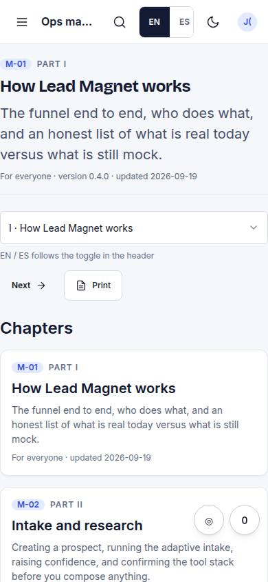
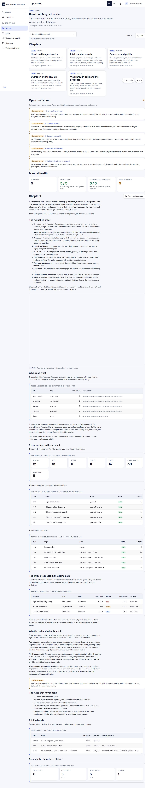

# M-01 · Ops manual home

## Purpose

How we run Lead Magnet. M-01 is both the table of contents and Part I: the chapter index with part, role and summary; every open decision collected from every chapter; the manual health (translation coverage, front-matter completeness); and chapter I rendered in place, with a "read the whole manual" mode that prints as one document.

## Screenshots

| 390 | 1280 |
| --- | --- |
|  |  |

Dark: `../screenshots/M-01/390-dark.jpg`, `../screenshots/M-01/1280-dark.jpg` (key pages).

## Sections (layout order)

1. Chapter head (Part I front matter)
2. Switcher + print
3. Chapter index cards (code, part, title, summary, role, updated)
4. Open decisions, collected from every chapter
5. Manual health (chapters, translated, front matter, open decisions)
6. Chapter I in place - or the whole manual, toggled

## Data

| Table | Read / write | Notes |
| --- | --- | --- |
| `prospects` | read | `{{prospects}}`, `{{archetypes}}`, `{{pricebands}}`, `{{kpi:intake}}` |
| `pages` | read | live-page column and `{{kpi:calls}}` |
| `events` | read | `{{kpi:funnel}}` |
| `touches` | read | `{{channels}}`, `{{kpi:outreach}}` |
| `bookings` | read | `{{kpi:calls}}` |
| `docs/ops-manual/<lang>/*.md` | read | the chapter prose itself, lazily imported as raw text |
| `docs/screenshots/<CODE>/1280.jpg` | read | Vite asset glob for `[screenshot: ...]` figures |

## Actions

| id | intent | permission |
| --- | --- | --- |
| `manual.openChapter` | "open the {chapter} chapter of the ops manual" | - |
| `manual.readAll` | "show the whole ops manual as one page" | - |
| `manual.listDecisions` | "list the open decisions in the ops manual" | - |
| `manual.print` | "print this chapter of the ops manual" | - |

## Rules

- `R-M01` - every count, price, route, score and KPI in the chapter is a live-data directive, never typed prose. An unknown directive renders as a visible warning.
- `R-M02` - the chapter has an `es/` mirror with the same filename; a missing mirror falls back to English, says so in the header and is listed on M-01.

## Logic

- Loads every chapter of the current language (five small lazy chunks) to build the index, the open-decision list and the health tiles; nothing about the manual is hand-kept in code.
- **Open decisions** are parsed out of every chapter: a blockquote starting `> DECISION NEEDED:` (or `> DECISION PENDIENTE:`) renders inline in its chapter *and* is collected here with a link back. This list is the manual's half of the "Awaiting Justin" lane.
- **Manual health**: chapters, translation coverage (R-M02), front-matter completeness (the six mandatory keys) and the open-decision count. Gaps are named, not just counted, and a chapter file with no `M-` route bound to it is called out too.
- **Read the whole manual** renders every chapter in part order, so one print gives the complete document with a page break between chapters.
- Chapter I is rendered in place under the index, so `/manual` is a chapter as well as a table of contents.

## Components

Card, Badge, Button, Select, Stat, DataTable, EmptyState (plus `react-markdown` for prose). No hand-rolled table or button.

## Real vs mock

The chapters are real prose, written for this product, in English and Spanish. Every number in them is live from the running app (R-M01), so nothing in a chapter can go stale.

Mock: the data behind the live blocks is the MockProvider seed in this browser, so the counts are demo counts until Supabase lands (T44). Figures come from `docs/screenshots/<CODE>/1280.jpg` captured by `npm run screenshots`; a chapter that names a shot we have not captured shows a dashed frame with the expected path rather than a broken image.

## Responsive check (P-01)

Checked at: 360, 390, 768, 1280, 1920, 2560, 3840. No horizontal overflow at any width; the chapter switcher becomes full width and the prev / next footer stacks under 680 px; body type scales through the `--scale` bands to 36 px at 3840 for 10-foot reading. `@media print` drops the navigation, avoids breaking inside a live block, a figure or a decision, and page-breaks between chapters in "read the whole manual".

## Changelog

- `docs/changelog/_pending/manual.md`
