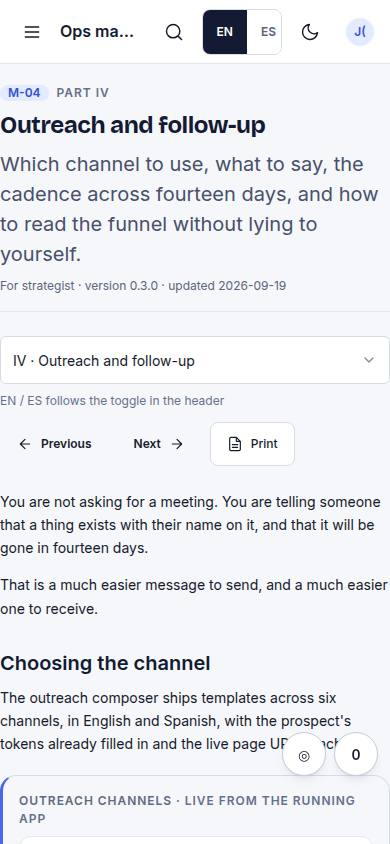
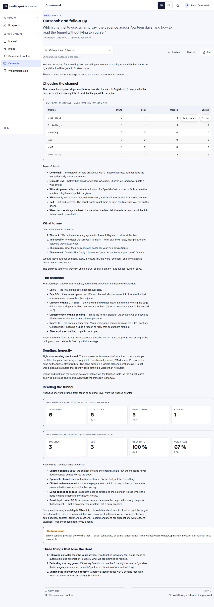

# M-04 · Chapter: outreach & follow-up

## Purpose

Channels, cadences, what to say, reading the funnel.

## Screenshots

| 390 | 1280 |
| --- | --- |
|  |  |

Dark: `../screenshots/M-04/390-dark.jpg`, `../screenshots/M-04/1280-dark.jpg` (key pages).

## Sections (layout order)

1. chapter

## Data

| Table | Read / write | Notes |
| --- | --- | --- |
| — | | no tables |

## Actions

| id | intent | permission |
| --- | --- | --- |
| — | | no actions declared yet |

## Rules

- none yet

## Logic

- (to be specified)

## Components

Card, Button

## Real vs mock

Stub (PageStub). Built by module manual (T33)

## Responsive check (P-01)

Not checked yet.

## Changelog

- `docs/changelog/0001-foundation.md`
