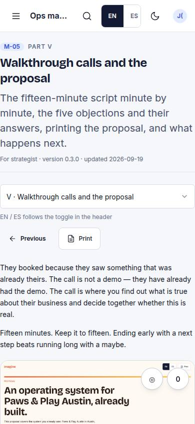
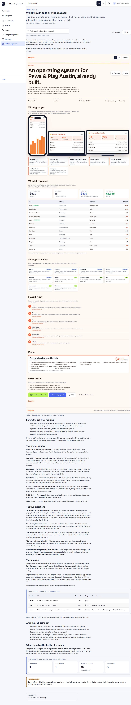

# M-05 · Chapter: walkthrough calls

## Purpose

Part V: the fifteen-minute walkthrough minute by minute, the five objections and their answers, printing the proposal, and what has to be written back into the profile the same day.

## Screenshots

| 390 | 1280 |
| --- | --- |
|  |  |

Dark: `../screenshots/M-05/390-dark.jpg`, `../screenshots/M-05/1280-dark.jpg` (key pages).

## Sections (layout order)

1. Chapter head
2. Switcher + prev / next + print
3. Before the call
4. The fifteen minutes (minute-by-minute script)
5. The five objections
6. The proposal (`{{pricebands}}`)
7. After the call, same day
8. What a good call looks like afterwards (`{{kpi:calls}}`)
9. Open decision
10. Prev / next footer

## Data

| Table | Read / write | Notes |
| --- | --- | --- |
| `prospects` | read | `{{prospects}}`, `{{archetypes}}`, `{{pricebands}}`, `{{kpi:intake}}` |
| `pages` | read | live-page column and `{{kpi:calls}}` |
| `events` | read | `{{kpi:funnel}}` |
| `touches` | read | `{{channels}}`, `{{kpi:outreach}}` |
| `bookings` | read | `{{kpi:calls}}` |
| `docs/ops-manual/<lang>/*.md` | read | the chapter prose itself, lazily imported as raw text |
| `docs/screenshots/<CODE>/1280.jpg` | read | Vite asset glob for `[screenshot: ...]` figures |

## Actions

| id | intent | permission |
| --- | --- | --- |
| `manual.openChapter` | "open the {chapter} chapter of the ops manual" | - |
| `manual.nextChapter` | "go to the next chapter" | - |
| `manual.prevChapter` | "go to the previous chapter" | - |
| `manual.print` | "print this chapter of the ops manual" | - |

## Rules

- `R-M01` - every count, price, route, score and KPI in the chapter is a live-data directive, never typed prose. An unknown directive renders as a visible warning.
- `R-M02` - the chapter has an `es/` mirror with the same filename; a missing mirror falls back to English, says so in the header and is listed on M-01.

## Logic

- The body is markdown in `docs/ops-manual/<lang>/NN-slug.md`, imported lazily (`import.meta.glob(..., { eager: false })`) so each chapter is its own chunk.
- Front matter (`title, role, part, version, updated, summary`) is parsed and shown as provenance; missing keys are named in the header rather than hidden.
- The language follows the app toggle. A chapter with no Spanish mirror renders English and shows an "English fallback" badge (R-M02).
- The body is split into prose, live blocks, figures and decision callouts before rendering; only prose goes through `react-markdown`.
- Prev / next comes from the part order in `MANUAL_CHAPTERS`, not from a hand-kept list.

## Components

Card, Badge, Button, Select, Stat, DataTable, EmptyState (plus `react-markdown` for prose). No hand-rolled table or button.

## Real vs mock

The chapters are real prose, written for this product, in English and Spanish. Every number in them is live from the running app (R-M01), so nothing in a chapter can go stale.

Mock: the data behind the live blocks is the MockProvider seed in this browser, so the counts are demo counts until Supabase lands (T44). Figures come from `docs/screenshots/<CODE>/1280.jpg` captured by `npm run screenshots`; a chapter that names a shot we have not captured shows a dashed frame with the expected path rather than a broken image.

## Responsive check (P-01)

Checked at: 360, 390, 768, 1280, 1920, 2560, 3840. No horizontal overflow at any width; the chapter switcher becomes full width and the prev / next footer stacks under 680 px; body type scales through the `--scale` bands to 36 px at 3840 for 10-foot reading. `@media print` drops the navigation, avoids breaking inside a live block, a figure or a decision, and page-breaks between chapters in "read the whole manual".

## Changelog

- `docs/changelog/0011-manual.md`
