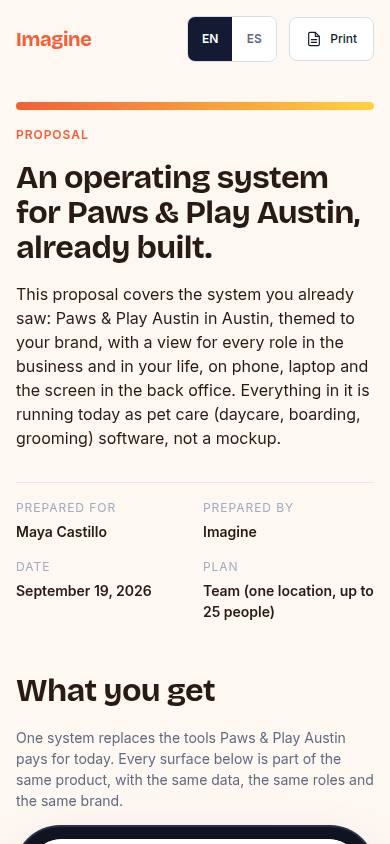
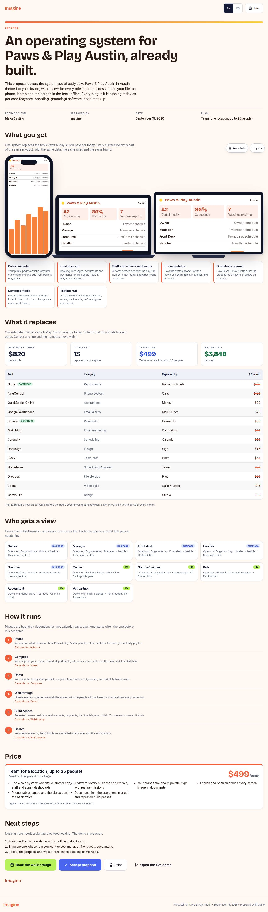

# R-01 · Client proposal view

## Purpose

The full stack for one prospect: their OS, savings, roles, timeline, price, next steps; printable.

## Screenshots

| 390 | 1280 |
| --- | --- |
|  |  |

Dark: `../screenshots/R-01/390-dark.jpg`, `../screenshots/R-01/1280-dark.jpg` (key pages).

## Sections (layout order)

1. cover
2. what you get
3. savings
4. roles
5. timeline
6. price
7. accept (Placeholder)

## Data

| Table | Read / write | Notes |
| --- | --- | --- |
| `prospects` | read | |
| `stack_guesses` | read | |
| `pages` | read | |

## Actions

| id | intent | permission |
| --- | --- | --- |
| `proposal.accept` | "accept the proposal" | any |
| `proposal.print` | "print the proposal" | `proposal.read` |

## Rules

- none yet

## Logic

- (to be specified)

## Components

Card, Stat, DataTable, Placeholder

## Real vs mock

Stub (PageStub). Built by module proposal (T16)

## Responsive check (P-01)

Not checked yet.

## Changelog

- `docs/changelog/0001-foundation.md`
