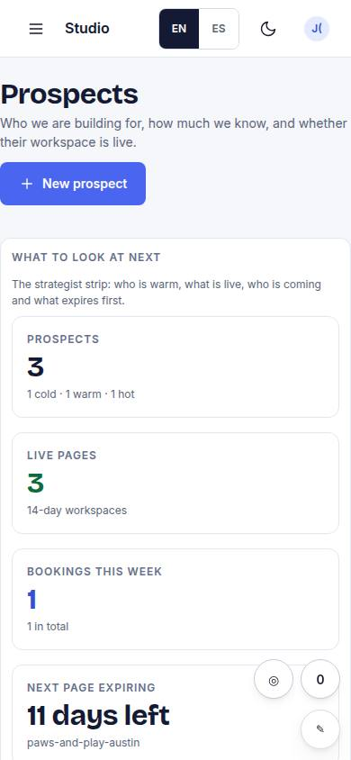
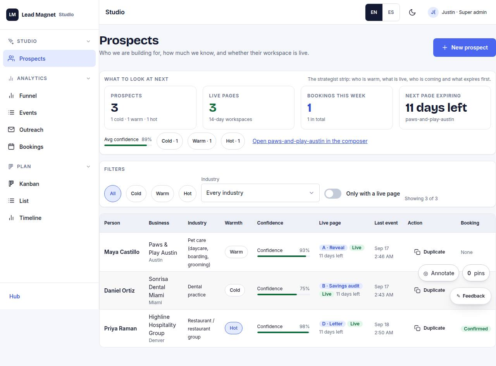

# S-01 · Prospects list

## Purpose

Every prospect with warmth, confidence, live page, last event; filters; new prospect.

## Screenshots

| 390 | 1280 |
| --- | --- |
|  |  |

Dark: `../screenshots/S-01/390-dark.jpg`, `../screenshots/S-01/1280-dark.jpg` (key pages).

## Sections (layout order)

1. filters
2. DataTable
3. new prospect

## Data

| Table | Read / write | Notes |
| --- | --- | --- |
| `prospects` | read | |
| `pages` | read | |
| `events` | read | |

## Actions

| id | intent | permission |
| --- | --- | --- |
| `studio.newProspect` | "create a prospect" | `prospects.write` |
| `studio.openProspect` | "open prospect {name}" | any |

## Rules

- none yet

## Logic

- (to be specified)

## Components

DataTable, Chip, Button, Badge

## Real vs mock

Stub (PageStub). Built by module studio (T11)

## Responsive check (P-01)

Not checked yet.

## Changelog

- `docs/changelog/0001-foundation.md`
