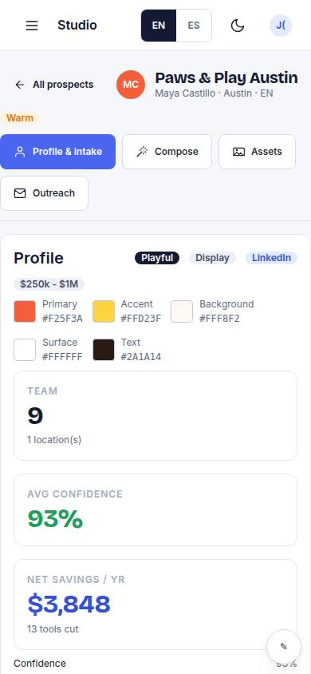
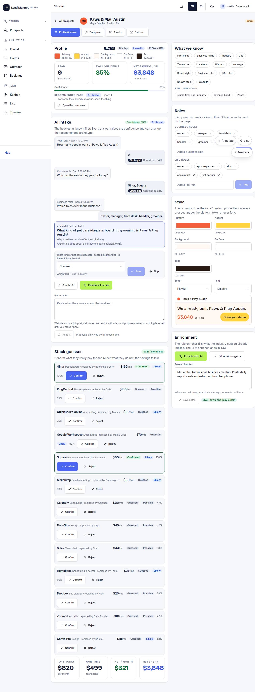

# S-02 · Prospect profile + AI intake

## Purpose

Profile, confidence meter, nextQuestions() as an adaptive intake form, applyAnswer() updates; stack guesses to confirm/reject; enricher status (LLM not wired).

## Screenshots

| 390 | 1280 |
| --- | --- |
|  |  |

Dark: `../screenshots/S-02/390-dark.jpg`, `../screenshots/S-02/1280-dark.jpg` (key pages).

## Sections (layout order)

1. header
2. confidence
3. intake questions
4. stack guesses
5. roles
6. style

## Data

| Table | Read / write | Notes |
| --- | --- | --- |
| `prospects` | read | |
| `stack_guesses` | read | |

## Actions

| id | intent | permission |
| --- | --- | --- |
| `studio.answerQuestion` | "answer {field} with {value}" | `prospects.write` |
| `studio.confirmTool` | "confirm {tool}" | `prospects.write` |
| `studio.runEnricher` | "enrich this prospect" | `prospects.write` |

## Rules

- none yet

## Logic

- (to be specified)

## Components

ProgressBar, Field, Input, Select, DataTable, Placeholder

## Real vs mock

Stub (PageStub). Built by module studio (T11)

## Responsive check (P-01)

Not checked yet.

## Changelog

- `docs/changelog/0001-foundation.md`
