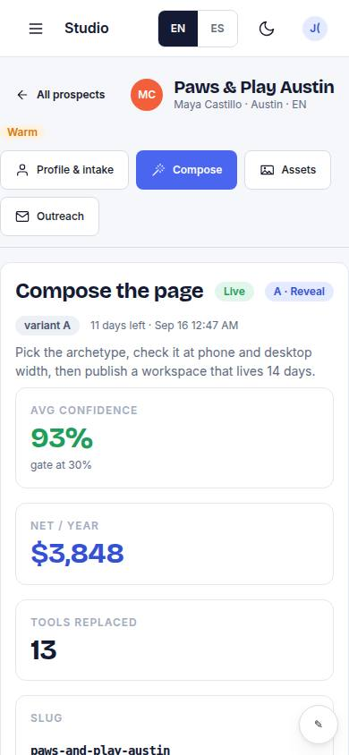
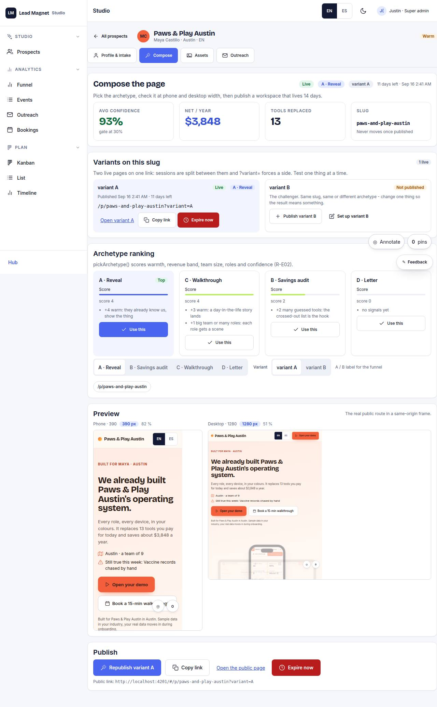

# S-03 · Page composer

## Purpose

pickArchetype() ranking with reasons, composePage() preview in ViewportFrame at 390 / 1280, variant, publish (14 days).

## Screenshots

| 390 | 1280 |
| --- | --- |
|  |  |

Dark: `../screenshots/S-03/390-dark.jpg`, `../screenshots/S-03/1280-dark.jpg` (key pages).

## Sections (layout order)

1. archetype ranking
2. preview
3. variant
4. publish

## Data

| Table | Read / write | Notes |
| --- | --- | --- |
| `prospects` | read | |
| `pages` | read | |
| `stack_guesses` | read | |

## Actions

| id | intent | permission |
| --- | --- | --- |
| `studio.pickArchetype` | "use the {archetype} archetype" | `pages.publish` |
| `studio.publishPage` | "publish the page" | `pages.publish` |
| `studio.expirePage` | "expire the page" | `pages.publish` |

## Rules

- none yet

## Logic

- (to be specified)

## Components

ViewportFrame, SegmentedControl, Button, Badge

## Real vs mock

Stub (PageStub). Built by module studio (T11)

## Responsive check (P-01)

Not checked yet.

## Changelog

- `docs/changelog/0001-foundation.md`
