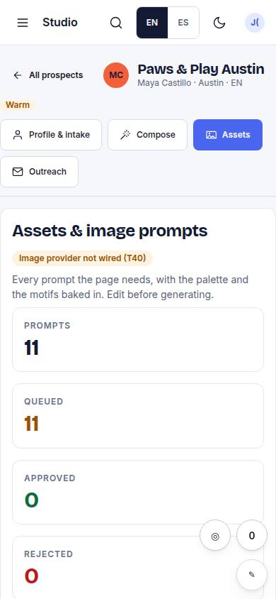
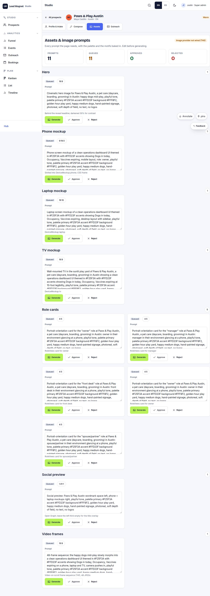

# S-04 · Assets & image prompts

## Purpose

imagePrompts() per kind with status; generate is a Placeholder until the provider is wired (T40); approve / reject.

## Screenshots

| 390 | 1280 |
| --- | --- |
|  |  |

Dark: `../screenshots/S-04/390-dark.jpg`, `../screenshots/S-04/1280-dark.jpg` (key pages).

## Sections (layout order)

1. prompt cards by kind
2. generate (Placeholder)
3. approve / reject

## Data

| Table | Read / write | Notes |
| --- | --- | --- |
| `assets` | read | |
| `prospects` | read | |

## Actions

| id | intent | permission |
| --- | --- | --- |
| `studio.generateAsset` | "generate the {kind} image" | any |
| `studio.approveAsset` | "approve {asset}" | `prospects.write` |

## Rules

- none yet

## Logic

- (to be specified)

## Components

Card, Textarea, Placeholder, Badge

## Real vs mock

Stub (PageStub). Built by module studio (T11)

## Responsive check (P-01)

Not checked yet.

## Changelog

- `docs/changelog/0001-foundation.md`
