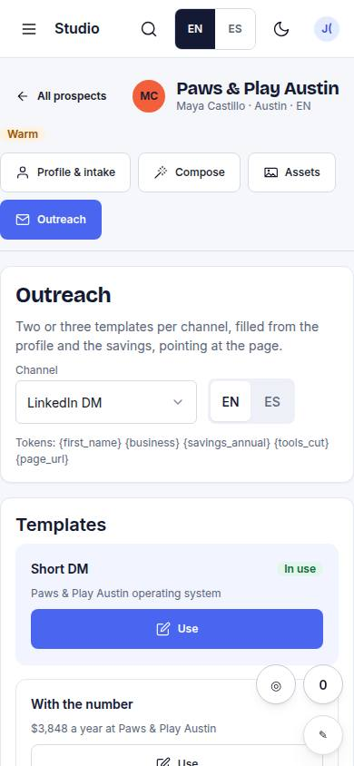
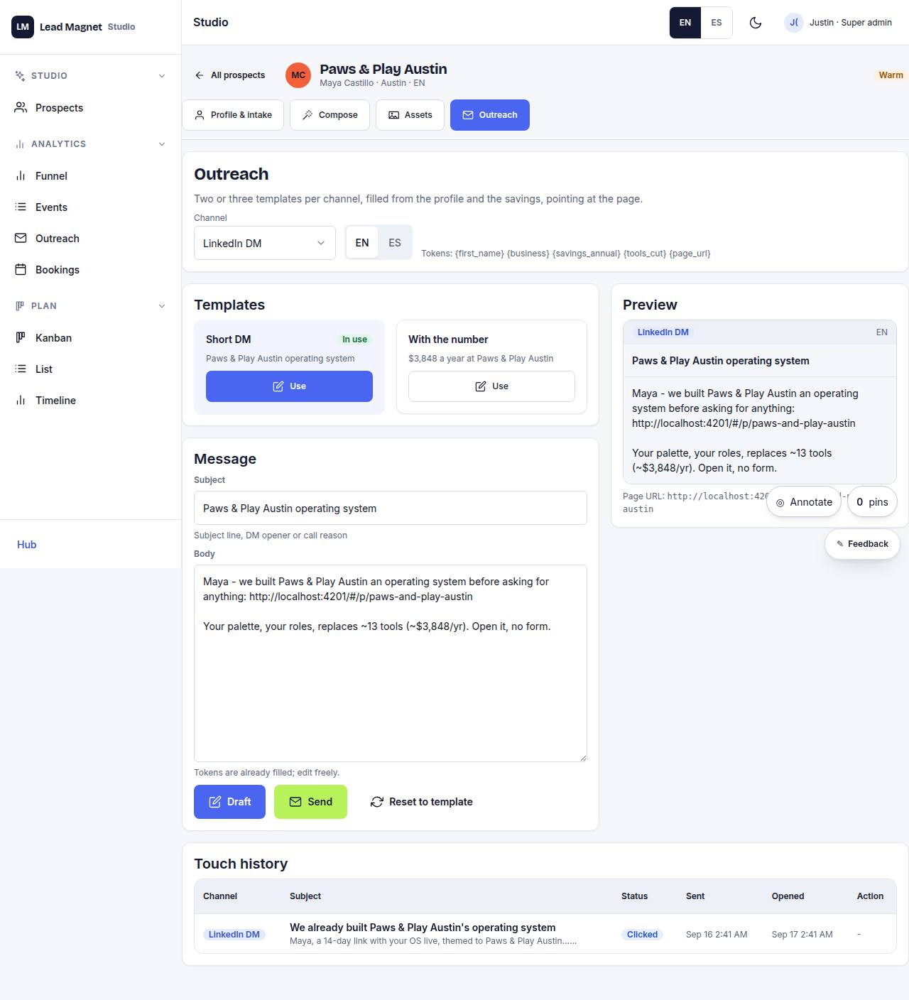

# S-05 · Outreach composer

## Purpose

Cold / warm messages per channel pointing at the page; templates filled with prospect tokens; send is a Placeholder.

## Screenshots

| 390 | 1280 |
| --- | --- |
|  |  |

Dark: `../screenshots/S-05/390-dark.jpg`, `../screenshots/S-05/1280-dark.jpg` (key pages).

## Sections (layout order)

1. channel
2. template
3. preview
4. send (Placeholder)
5. touches history

## Data

| Table | Read / write | Notes |
| --- | --- | --- |
| `touches` | read | |
| `prospects` | read | |
| `pages` | read | |

## Actions

| id | intent | permission |
| --- | --- | --- |
| `studio.draftTouch` | "draft a {channel} message" | `prospects.write` |
| `studio.sendTouch` | "send the message" | any |

## Rules

- none yet

## Logic

- (to be specified)

## Components

Select, Textarea, DataTable, Placeholder

## Real vs mock

Stub (PageStub). Built by module studio (T11)

## Responsive check (P-01)

Not checked yet.

## Changelog

- `docs/changelog/0001-foundation.md`
