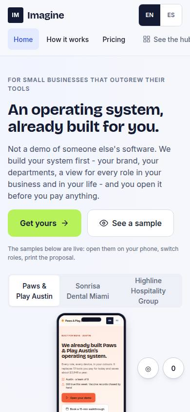
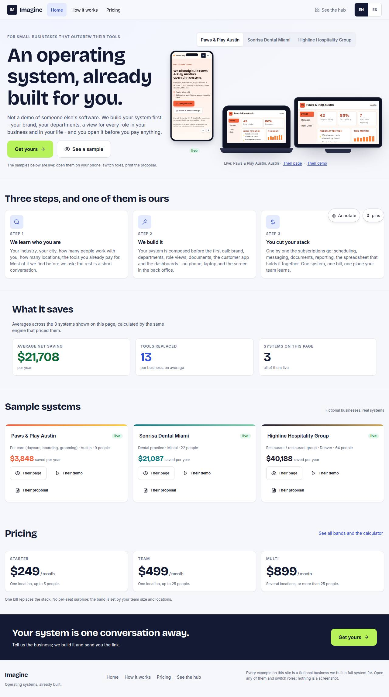

# W-01 · Website home

## Purpose

Imagine's public site: the offer (an OS already built for you), sample prospect pages, how it works, pricing.

## Screenshots

| 390 | 1280 |
| --- | --- |
|  |  |

Dark: `../screenshots/W-01/390-dark.jpg`, `../screenshots/W-01/1280-dark.jpg` (key pages).

## Sections (layout order)

1. hero
2. samples
3. how
4. pricing teaser
5. footer

## Data

| Table | Read / write | Notes |
| --- | --- | --- |
| `prospects` | read | |

## Actions

| id | intent | permission |
| --- | --- | --- |
| `site.seeSample` | "open a sample landing page" | any |
| `site.startPurchase` | "start the purchase flow" | any |

## Rules

- none yet

## Logic

- (to be specified)

## Components

DeviceMockup, Card, Button

## Real vs mock

Stub (PageStub). Built by module website (T16)

## Responsive check (P-01)

Not checked yet.

## Changelog

- `docs/changelog/0001-foundation.md`
