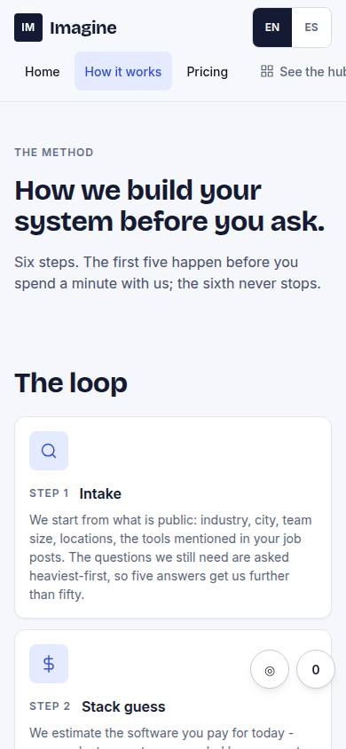
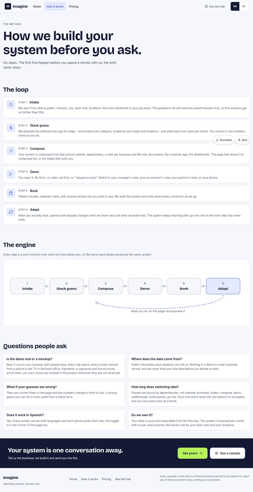

# W-02 · How it works

## Purpose

Intake -> stack guess -> compose -> demo -> book; the AI methodology explained.

## Screenshots

| 390 | 1280 |
| --- | --- |
|  |  |

Dark: `../screenshots/W-02/390-dark.jpg`, `../screenshots/W-02/1280-dark.jpg` (key pages).

## Sections (layout order)

1. steps
2. engine diagram
3. faq

## Data

| Table | Read / write | Notes |
| --- | --- | --- |
| — | | no tables |

## Actions

| id | intent | permission |
| --- | --- | --- |
| — | | no actions declared yet |

## Rules

- none yet

## Logic

- (to be specified)

## Components

Card

## Real vs mock

Stub (PageStub). Built by module website (T16)

## Responsive check (P-01)

Not checked yet.

## Changelog

- `docs/changelog/0001-foundation.md`
