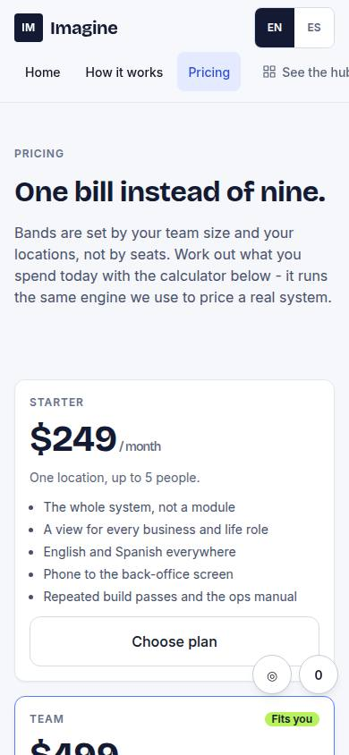
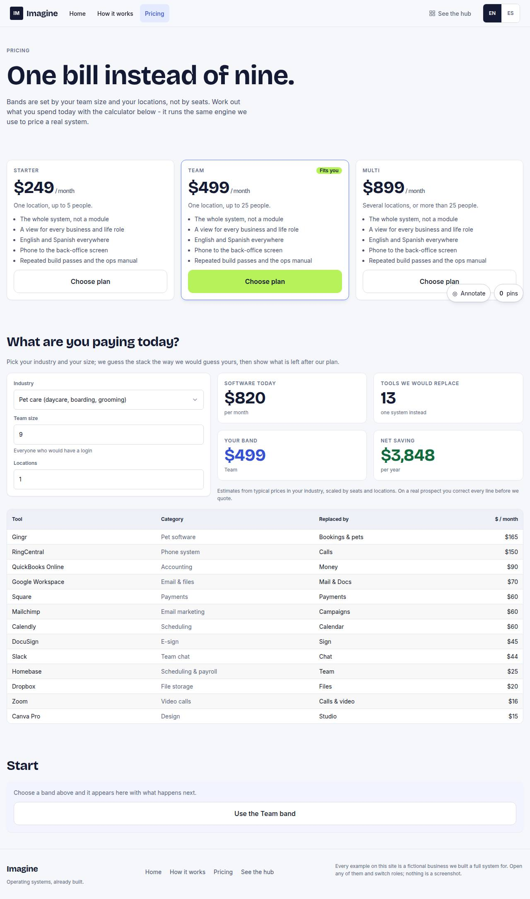

# W-03 · Pricing + purchase flow

## Purpose

What it costs and what you are spending today. Three bands priced from the engine, a calculator that guesses a visitor's stack from their industry, team size and locations, and a purchase flow that stops honestly at a marked checkout placeholder while still recording that someone wanted to buy.

## Screenshots

| 390 | 1280 |
| --- | --- |
|  |  |

## Sections (layout order)

1. Top nav
2. Intro - "one bill instead of nine"; dev mode adds the D-014 proposed note
3. Bands - starter / team / multi at `PRICE_MONTHLY`, the band that fits the calculator marked "Fits you", what is included, Choose plan
4. Savings calculator - industry, team size, locations; software today, tools we would replace, your band, net saving; the guessed stack as a table
5. Start - the checkout card: the chosen band, what happens next, "Continue to payment" (Placeholder, T51) and "Talk to us first"
6. Footer

## Data

| Table | Read / write | Notes |
| --- | --- | --- |
| `events` | write | `view`, `form_submit` (choose plan, with band, industry, team, locations), `cta_click` |

No prospect row is written: the calculator's prospect is synthetic and never stored (it exists for the length of a render).

## Actions

| id | intent | permission |
| --- | --- | --- |
| `site.choosePlan` | "choose the {band} plan" | any |
| `site.calcSavings` | "estimate the saving for a {industry} with {team} people" | any |
| `site.checkout` | "pay for the plan" | any (Placeholder: Stripe, T51) |

## Rules

- `R-W01` - bands, costs and savings come from `PRICE_MONTHLY`, `priceBand()`, `guessStack()` and `savings()`; nothing is typed into the page

## Logic

- `syntheticProspect(industry, team, locations)` builds a throwaway `ProspectRow` and runs the same engine a real prospect gets, so the public number and the proposal number cannot disagree.
- Inputs are clamped (team 1..500, locations 1..50) before they reach the engine; the band marked "Fits you" is `priceBand()` over the same values.
- Choose plan records a `form_submit` event (band + the calculator inputs) and scrolls to the checkout card, honouring `prefers-reduced-motion`.
- The checkout button is a `Placeholder` (`will: take payment with Stripe checkout and create the account`, `by: T51`): tooltip on hover and focus, toast on activation, dashed badge in dev mode. The intent is captured even though the payment is not.

## Components

SiteChrome, Card, Stat, Badge, Button, Select, Input, Field, Placeholder, DataTable, LangToggle.

## Real vs mock

Real: every price and every saving, the guessed stack, the recorded intent. Mock: the payment itself (T51) and, until Justin confirms, the price bands (D-014 proposed, shown as such in dev mode).

## Responsive check (P-01)

Checked at 360, 390, 768, 1280, 1920, 2560, 3840. Bands collapse to one column under 600 px, the calculator to one column under 1100 px; the stack table becomes labelled cards under 768 px; number inputs use `inputMode="numeric"` and the 48 px control height; every control is keyboard reachable in source order.

## Changelog

- `docs/changelog/0008-proposal-website.md` (T16)
